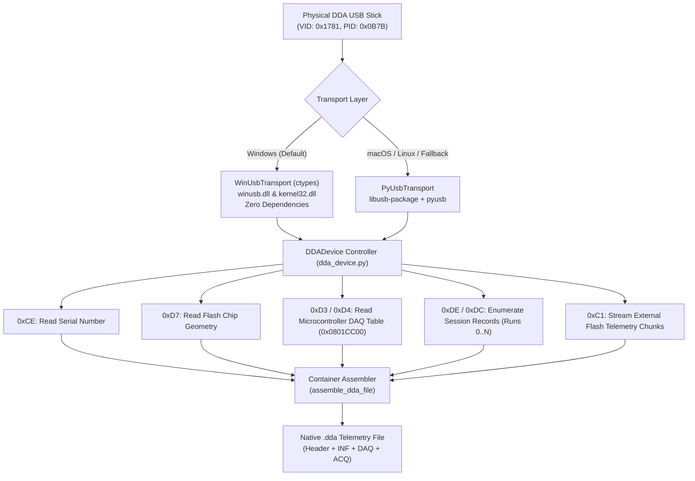

# ⚡ Ducati Data Analyzer (DDA) USB Hardware Downloader

## 📖 Overview

The **DDA Hardware Downloader** is a reverse-engineered, non-destructive USB extraction engine for **Ducati Data Analyzer (DDA / DDA+ / DDA Evo)** telemetry logger sticks.

Historically, extracting recorded session data from a physical DDA stick required the proprietary OEM Windows utility (`dda-downloader.exe`), which runs in the system tray and locks down the device. The DDA stick is not a standard USB Mass Storage / Flash drive (it does not appear as a disk drive in Windows Explorer or Disk Management); instead, it operates as a custom **WinUSB bulk endpoint device**.

This engine delivers:
1. **Direct Hardware Extraction**: Reads recorded session runs directly from the physical USB stick into native `.dda` files.
2. **Zero-Dependency Native Windows Transport**: Implements direct `ctypes` bindings to Windows' built-in `winusb.dll`, requiring **zero third-party driver installations or external Python packages**.
3. **Cross-Platform LibUSB Fallback**: Fully compatible with macOS and Linux via `pyusb` and `libusb-package`.
4. **100% Read-Only Safety Guarantee**: Exclusively executes safe memory query opcodes; all flash erase and format commands are strictly omitted to protect the physical stick.
5. **Universal Motorcycle Support**: Dynamically reads the active acquisition definition table from the stick's onboard microcontroller flash, automatically supporting any Ducati model (Panigale V4/V2, 1199/1299, 1098/1198 SBK, Streetfighter, Monster, Multistrada, Hypermotard, Desmosedici RR).

---

## 🔬 Hardware Specifications & Protocol Architecture



### 1. USB Interface Parameters
* **Vendor ID (VID)**: `0x1781`
* **Product ID (PID)**: `0x0B7B`
* **Device Name**: `ProsaDDA Device libusb-1.0` / `Ducati Data Analyzer`
* **Device Interface GUID**: `{044F0DE0-4B4C-4247-B18A-4C8F1FFB67A8}`
* **Endpoints**:
  * `0x01` (Bulk OUT, 64-byte packets)
  * `0x81` (Bulk IN, 64-byte packets)
* **Timeout**: 4,000 ms

---

### 2. Reverse-Engineered Command Opcode Set (Read-Only)

| Opcode | Name | Outgoing Packet (Hex) | Response Prefix | Description |
| :---: | :--- | :--- | :---: | :--- |
| `0xCE` | **Read Serial Number** | `03 00 CE` | `0x0F` | Returns UTF-16LE hardware serial string (e.g., `0GOOA8BJ4M2B60373VPJ`). |
| `0xD7` | **Read Flash ID** | `03 00 D7` | `0x17` | Queries SPI Flash manufacturer ID and size geometry (e.g. `18 20 01 00`). |
| `0xD3` | **DAQ Table Info** | `03 00 D3` | `0x13` | Returns memory address (`0x0801CC00`) and byte size (`1,324 B`) of the channel table. |
| `0xD4` | **Micro Memory Read** | `07 00 D4 [Addr32]` | `0x14` | Reads internal MCU Flash memory containing channel IDs, multipliers, and intervals. |
| `0xDE` | **Run Record (V4)** | `05 00 DE [Idx16]` | `0x04` | 22-byte record containing start address, byte length, and bit-packed date/time. |
| `0xDC` | **Run Record (V3)** | `05 00 DC [Idx16]` | `0x04` | Fallback session query for older non-GPS DDA hardware generations. |
| `0xC1` | **Flash Block Read** | `07 00 C1 [Addr32]` | `0x05` | Reads up to 256 bytes per block of raw interleaved telemetry data from external flash. |

---

### 3. Date & Time Bit-Packing Algorithm
Session timestamps are bit-packed across 4 bytes in each run record:
```python
minute = resp[14]
hour = resp[15]

# Date is stored as a 16-bit little-endian word at offset 20
date_val = struct.unpack_from('<H', resp, 20)[0]
al = date_val & 0xFF
ah = (date_val >> 8) & 0xFF

year = (ah >> 1) + 2000
month = (((ah & 1) << 3) | (al >> 5)) + 1
day = al & 0x1F

dt = datetime(year, month, day, hour, minute)
```

---

### 4. Container Reassembly (.dda v4)
Once raw telemetry chunks and channel tables are retrieved from the device, `DDADevice.assemble_dda_file()` constructs a standard native binary container:
1. **Container Header**: 2-byte version (`0x04 0x00`) followed by 4 section descriptor table entries:
   * `DDA\0`: Table size declaration.
   * `INF\0`: Metadata offset (starts at byte 42, length 264 bytes).
   * `DAQ\0`: Channel definition block offset (starts at byte 306).
   * `ACQ\0`: Raw telemetry stream offset (`306 + len(DAQ)`).
2. **`INF` Block**: Contains 48-byte Track Name string, 44-byte Rider Name string, and timestamp parameters.
3. **`DAQ` Block**: Exact hardware acquisition channel table retrieved from MCU address `0x0801CC00`.
4. **`ACQ` Block**: Raw sequential binary telemetry stream.

---

## 🚀 How to Use the Downloader

### Method 1: Integrated Graphical Interface (GUI)

Launch the desktop application:
```powershell
python dda_converter_gui.py
# Or double click dist\Ducati DDA Reader.exe
```

1. Click **`⚡ Download from DDA Stick`** in the top header banner (or **`⚡ Read Stick...`** next to the Browse button).
2. The dialog will connect to your stick, display the serial number, and populate the session table:
   * **Copy Checkboxes**: Select all or individual runs.
   * **Run #**: Device memory index.
   * **Date & Time**: Decoded recording start time.
   * **Data Size & Est. Duration**: Byte size and calculated riding duration.
3. Choose the **Destination Folder** (defaults to `./downloads/` with a **Browse...** button).
4. Click **`⬇️ Download Selected Runs`** to begin high-speed extraction with a live progress bar and transfer speed indicator.
5. On completion, click **Yes** on the prompt to immediately decode and open the latest run in the Telemetry Inspector and 3D Visualizer.

---

### Method 2: Standalone Interactive CLI

Run the dedicated downloader CLI in PowerShell or Terminal:
```powershell
python dda_device.py
```

**Interactive Terminal Example**:
```text
======================================================================
  DUCATI DATA ANALYZER (DDA) USB DOWNLOADER
  Safe, Read-Only Telemetry Extraction Utility
======================================================================

Scanning USB buses for DDA stick...
[✓] Connected to DDA Stick!
    Serial Number : 0GOOA8BJ4M2B60373VPJ
    Flash Chip ID : 18 20 01 00

Reading session index from device memory...

Found 47 Recorded Run(s) on Stick:

  #    | Date & Time       | Size         | Est. Duration  | Start Addr  
  ------------------------------------------------------------------
  0    | 2024-09-03 00:02  |     118.4 KB |         6m 07s | 0x0         
  1    | 2024-09-03 00:07  |      95.9 KB |         4m 57s | 0x1d970     
  2    | 2024-09-03 00:03  |       3.0 KB |         0m 09s | 0x358e0     
  3    | 2024-09-03 00:05  |      37.3 KB |         1m 55s | 0x364f0     
  ...

Options:
  - Enter run numbers separated by spaces (e.g. '0 1 4')
  - Enter 'all' to download all recorded runs
  - Enter 'q' to quit without downloading

Select runs to download [default: all]: 0 1
Enter destination directory [default: ./downloads]: downloads

Downloading 2 run(s) to: ./downloads

[1/2] Downloading Run #00 (2024-09-03 00:02, 118.4 KB)...
  [███████████████████████████████████] 100.0% (118.4/118.4 KB at 82.5 KB/s)
      Saved: downloads/Run000_20240903_000200.dda

[2/2] Downloading Run #01 (2024-09-03 00:07, 95.9 KB)...
  [███████████████████████████████████] 100.0% (95.9/95.9 KB at 81.3 KB/s)
      Saved: downloads/Run001_20240903_000700.dda

======================================================================
[✓] Successfully downloaded 2 native .dda file(s)!
======================================================================
```

---

### Method 3: Python API Programmatic Usage

Integrate direct hardware downloads into your own Python workflows:

```python
from dda_device import DDADevice
from dda_core import DDAParser

# 1. Initialize and inspect device
device = DDADevice()
print("Connected:", device.is_connected())
print("Serial Number:", device.get_serial_number())

# 2. List all recorded sessions on the stick
runs = device.list_runs()
for r in runs:
    print(f"Run #{r.index}: {r.datetime_str} ({r.size_kb:.1f} KB)")

# 3. Download Run #0 to a local file
if runs:
    saved_file = device.download_run_to_file(runs[0], destination_folder="downloads")
    print("Saved native file to:", saved_file)

    # 4. Immediately parse and export telemetry
    parser = DDAParser(saved_file)
    parser.parse()
    parser.export_html("downloads/latest_session_viewer.html")
    parser.export_racechrono_rcz("downloads/latest_session.rcz")
```

---

## 🔒 Exclusive Access & Background Process Handling

On Windows, the WinUSB driver grants exclusive handle access to one process at a time. If the official OEM utility (`dda-downloader.exe`) is running in the Windows system tray, it holds an active handle on Interface 0.

* **Automatic Detection**: Both `dda_device.py` and the GUI automatically check if `dda-downloader.exe` is running via Windows process queries.
* **1-Click Helper**: 
  * In the GUI, an orange banner appears with a **`Close OEM Downloader`** button.
  * In the CLI, the prompt asks: `Close DDA Downloader now to allow USB access? [Y/n]`.
* **Zero Lockup Guarantee**: All read operations automatically release their USB handles in `finally` blocks, preventing the stick from remaining locked if an error or user cancellation occurs.

---

## 🏍️ Universal Compatibility Matrix

| Hardware Generation | Motorcycles | GPS Integration | Status |
| :--- | :--- | :---: | :---: |
| **DDA+ GPS (1714 / V4)** | Panigale V4 / V4S / V4R / SP2, Streetfighter V4, Panigale V2 | ✅ 10 Hz GPS Fixes | **Full Support** |
| **DDA+ GPS (1199 / 1299)** | Panigale 1199 / 1299 / 899 / 959, SuperSport 939 / 950 | ✅ 10 Hz GPS Fixes | **Full Support** |
| **DDA Evo** | Monster 1200 / 821, Hypermotard 939 / 950, Multistrada 1200 / 1260 | Optional | **Full Support** |
| **DDA Classic** | SBK 1098 / 1198 / 848, Desmosedici RR, Streetfighter 1098 | ❌ CAN Telemetry Only | **Full Support** |
