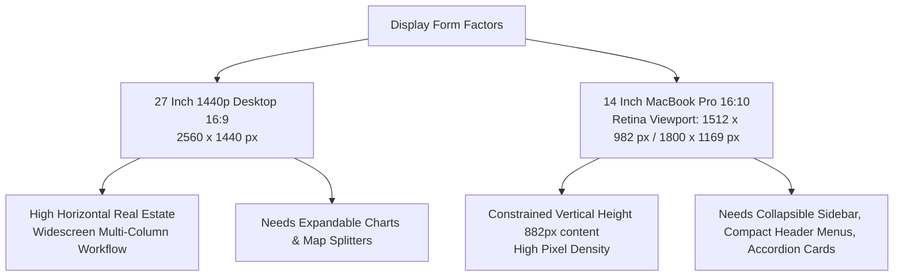
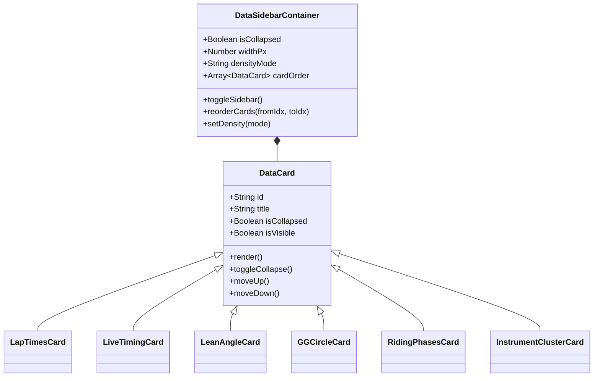
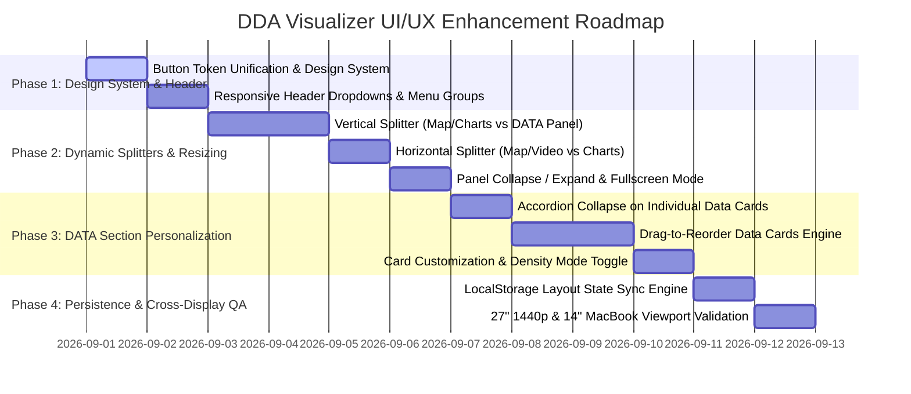

# 🏁 Ducati DDA Telemetry Pro - UI/UX Architecture & Interface Review

**Document Version:** 1.0.0  
**Author:** Antigravity UI/UX Expert  
**Target Displays:** 27" QHD Desktop (2560×1440, 16:9) & 14" MacBook Pro Liquid Retina XDR (3024×1964 @2x = 1512×982 / 1800×1169, 16:10)  
**Status:** Under Review  

---

## 1. Executive Summary & Design Vision

The **Ducati DDA Telemetry & GPS Visualizer Pro** is a high-performance web-based motorsport analytics suite. It merges binary telemetry decoding with interactive GIS track mapping, multi-channel synchronized waveform scrubbing, dynamic chassis dynamics (G-G friction circle, lean angle visualizer, riding phases), and broadcast-grade video HUD generation.

While the visualizer possesses strong domain fundamentals and authentic Ducati/MotoGP visual branding, the current interface exhibits key ergonomic bottlenecks:
1. **Rigid Layout & Static Sizing:** Panel dimensions are hardcoded in CSS Grid (`1fr 430px`, `1fr 270px 50px`), preventing users from resizing panels to match their analysis workflows or screen sizes.
2. **Display Inflexibility:** On **14" MacBook displays** (16:10 aspect ratio, ~982px viewport height), the header buttons overflow, and the 6-card DATA sidebar exceeds 1,100px in height, requiring constant scrolling. On **27" 1440p desktop displays** (16:9 aspect ratio, 2560px width), vast horizontal space remains underutilized without dynamic multi-column resizing.
3. **Static Monolithic DATA Section:** The right sidebar contains 6 fixed cards with no ability to reorder, collapse, hide, or resize individual widgets.
4. **Header Button Crowding & Style Inconsistencies:** Over 10 buttons are laid out in a flat row without menu grouping, causing aggressive wrapping and layout breaks on medium viewports. Styling varies across different button classes (`.btn`, `.btn-tool`, `.btn-tool-sm`, `.btn-transport`, `.btn-xs`) in padding, border-radii, and active states.

This review provides a comprehensive UI/UX redesign blueprint featuring **dynamic splitters with drag-to-resize handles**, **collapsible/toggleable screen sections with minimum-size bounds**, a **customizable/drag-reorderable DATA sidebar**, **responsive grouped menus**, and a **unified Design System**.

---

## 2. Display Ergonomics & Viewport Benchmark



### 2.1 Viewport Comparison Matrix

| Ergonomic Metric | 27" Desktop (1440p, 16:9) | 14" MacBook Pro (Default 2x Retina) | 14" MacBook Pro ("More Space" 16:10) |
| :--- | :---: | :---: | :---: |
| **Physical Resolution** | $2560 \times 1440\text{ px}$ | $3024 \times 1964\text{ px}$ | $3024 \times 1964\text{ px}$ |
| **CSS Logical Viewport** | **$2560 \times 1440\text{ px}$** | **$1512 \times 982\text{ px}$** | **$1800 \times 1169\text{ px}$** |
| **Aspect Ratio** | 16:9 (Widescreen) | 16:10 (Taller Aspect) | 16:10 (Taller Aspect) |
| **Available Content Height** *(minus 50px header + 50px transport)* | **$1340\text{ px}$** | **$882\text{ px}$** | **$1069\text{ px}$** |
| **Current Header Bar Status** | Fits comfortably (flat row) | ⚠️ **Overflows & clips buttons** (total width req > 1620px with Compare Bar) | Tight / Borderline fit |
| **DATA Sidebar Status** | All 6 cards visible without scroll | ❌ **Heavy scrolling** (1,150px total card height vs. 882px viewport) | Moderate scrolling |
| **Telemetry Waveform Width** | $2114\text{ px}$ (Excessive horizontal stretch) | $1066\text{ px}$ (Optimal waveform resolution) | $1354\text{ px}$ |

### 2.2 Key Findings & Display Adaptation Strategy

1. **MacBook 14" Optimization Priorities:**
   - **Header Menu Consolidation:** Group secondary actions into categorized dropdown menus (`Analysis ▾`, `View ▾`, `Video ▾`) to keep total header width well under $1200\text{ px}$.
   - **Accordion DATA Cards:** Allow each card in the DATA sidebar to collapse to a compact $28\text{ px}$ header bar, letting riders focus on relevant widgets (e.g. Lap Times + Lean Angle) without scrolling.
   - **Collapsible DATA Sidebar:** 1-click toggle button to collapse the entire sidebar to $0\text{ px}$, giving full width to map and telemetry waveforms.
2. **27" Desktop Optimization Priorities:**
   - **Dynamic 3-Column Split & Multi-Pane Layout:** Seamlessly drag splitters between Map, Waveforms, and Gauges.
   - **Vertical Expansion for Telemetry Channels:** Allow expanding the bottom chart panel to 400px–600px height to view 6+ distinct channel lanes simultaneously with high fidelity.

---

## 3. Workspace Layout & Dynamic Resizing/Toggle Architecture

### 3.1 Current Architectural Limitations
- **Rigid Layout:** Fixed CSS Grid layout `grid-template-columns: 1fr 430px; grid-template-rows: 1fr 270px 50px;`.
- **No Draggable Resizers:** Users cannot adjust the ratio between the GPS Map and the Telemetry Waveforms, or widen the DATA sidebar for large tables.
- **Brittle Video Split CSS:** In video split mode, the layout applies `float: left; width: 50%` and `margin-left: 50%` inside grid cells, breaking semantic layout flow.

### 3.2 Proposed Dynamic Splitter & Docking Architecture

```
+---------------------------------------------------------------------------------------------------------+
|  HEADER BAR: Logo & Metadata [ sonoma ]  |  [Compare Bar]  |  [Analysis ▾] [View ▾] [Video ▾] [📁 Open]  |
+------------------------------------------------------------------------------------+--------------------+
|                                                                                    |                    |
|   TOP WORKSPACE: GPS Map & Video Viewport                                          |   DATA SIDEBAR     |
|   - Toggleable / Maximize Mode                                                     |   (Re-orderable    |
|   - Video/Map Draggable Splitter (in Split Mode)                                   |    & Collapsible)  |
|                                                                                    |                    |
|                                                                                    |   [≡ Lap Times]    |
|                                                                                    |   [≡ Live Timing]  |
+============================ HORIZONTAL RESIZE SPLITTER ============================+   [≡ Lean Gauge]   |
|                                                                                    |   [≡ G-G Circle]   |
|   BOTTOM WORKSPACE: Synchronized Telemetry Waveforms                               |   [≡ Riding Phase] |
|   - Toggleable Channel Filter Pills                                                |   [≡ Tach & Gauges]|
|   - Drag-to-Resize Height (Min: 120px, Max: 75vh, Collapsible to 36px)             |                    |
|                                                                                    |                    |
+------------------------------------------------------------------------------------+--------------------+
|  TRANSPORT BAR: [ ▶ ] [ ◀ 0.1s ] [ ▶ 0.1s ] [ 1.0x ▾ ] | ===== Timeline Scrubber ===== | [ Jump ▾ ] [ ? ] |
+---------------------------------------------------------------------------------------------------------+
                                                                                     ▲
                                                                     VERTICAL RESIZE SPLITTER
```

### 3.3 Splitter & Toggle Specifications

| Panel / Component | Min Size | Default Size (1440p) | Default Size (MacBook) | Max Size | Toggle Action |
| :--- | :---: | :---: | :---: | :---: | :--- |
| **DATA Sidebar (Right)** | $300\text{ px}$ | $420\text{ px}$ | $360\text{ px}$ | $650\text{ px}$ | **Collapse to $0\text{ px}$** (Sidebar toggle icon in header/divider) |
| **Telemetry Charts (Bottom)** | $130\text{ px}$ | $320\text{ px}$ | $240\text{ px}$ | $75\text{ vh}$ | **Collapse to $36\text{ px}$ header** / **Maximize to $100\%$** |
| **GPS Track Map (Top Left)** | $200\text{ px}$ | Flexible (`1fr`) | Flexible (`1fr`) | $100\%$ | **Maximize to Fullscreen** |
| **Onboard Video (Split View)** | $240\text{ px}$ | $50\% / 50\%$ | $50\% / 50\%$ | $80\%$ | **Switch Map Only / Video Only / PIP** |

### 3.4 State Persistence
All layout adjustments (sidebar width, charts panel height, collapsed states, card order) will automatically persist to `localStorage` under `dda_layout_state`:
```json
{
  "sidebarWidth": 380,
  "sidebarCollapsed": false,
  "chartsHeight": 280,
  "chartsCollapsed": false,
  "layoutMode": "standard",
  "cardOrder": ["laptimes", "timing", "lean", "cluster", "gg", "phases"],
  "collapsedCards": ["phases"]
}
```

---

## 4. "DATA" Section: Re-Orderable & Adjustable Component System

The DATA sidebar provides real-time instruments and session summary data. To maximize usability across display sizes, it requires card-level personalization.



### 4.1 Card Personalization Features

1. **Interactive Drag-to-Reorder:**
   - Each card header features a six-dot drag handle icon (`⋮⋮`).
   - HTML5 Drag and Drop / pointer event support allows riders to drag cards into any order (e.g. putting Tach & Speed at the very top, or Lap Times at the top).
   - Card headers also include accessible Quick Move buttons (`▲` / `▼`) on hover.
2. **Card-Level Accordion Collapse:**
   - Every card has a smooth animated chevron toggle (`⌄` / `⌃`).
   - Collapsing a card shrinks it to a sleek $28\text{ px}$ pill showing its title and a live KPI snippet (e.g. `CHASSIS LEAN ANGLE — 44.2° R`).
3. **Card Visibility Manager ("Customize Cards" Dialog):**
   - Riders can toggle off cards they don't need (e.g. turning off DTC/Altitude for trackday sessions without electronic intervention).
4. **Density Modes (Compact vs. Standard):**
   - **Compact Mode (for MacBook 14"):** Reduces padding from $8\text{ px}$ to $4\text{ px}$, shrinks gauge SVG heights by $20\%$, and uses condensed mono typography.
   - **Standard Mode (for 27" Desktop):** High-contrast layout with full gauge dials and expanded sector timing badges.

---

## 5. Button Organization, Responsive Menus & Uniform Styling

### 5.1 Current Header Clutter vs. Redesigned Grouped Menus

#### Current Header (10+ Flat Buttons - Overflows on Laptops):
```
[DUCATI DDA] [Sonoma] [Compare Laps] [Lean vs TPS] [Scorecard] [MotoGP HUD] [🎬 Export Video] [Load Video] [3-Col Split] [MPH] [Settings] [Open File]
```

#### Proposed Responsive Header (Structured Groups + Categorized Dropdowns):
```
+---------------------------------------------------------------------------------------------------------+
| [DUCATI DDA PRO] Sonoma Raceway  |  [Compare Mode Bar]  |  [📊 Analysis ▾] [👁 View ▾] [🎬 Video ▾] [⚙] [📁 Open] |
+---------------------------------------------------------------------------------------------------------+
```

### 5.2 Dropdown Menu Item Specifications

```mermaid
graph TD
    Header[App Header Bar] --> M1["📊 Analysis Tools ▾"]
    Header --> M2["👁 View & Layout ▾"]
    Header --> M3["🎬 Video & HUD ▾"]
    Header --> M4["⚙ Settings"]
    Header --> M5["📁 Open File"]

    M1 --> A1["📈 Lean vs Throttle Heatmap (M)"]
    M1 --> A2["⏱ Turn-by-Turn Scorecard (T)"]
    M1 --> A3["✂ Corner Selection & Stack"]
    M1 --> A4["⚡ Theoretical Optimal Lap"]

    M2 --> V1["◫ 3-Column Split Mode (L)"]
    M2 --> V2["📐 Reset Panel Layout"]
    M2 --> V3["🧭 Toggle Gauge Sidebar"]
    M2 --> V4["🗖 Fullscreen Mode"]
    M2 --> V5["Toggle Units: MPH / KM/H (U)"]

    M3 --> VD1["🎬 Export MotoGP Video Overlay"]
    M3 --> VD2["📹 Load Onboard Video (V)"]
    M3 --> VD3["⏱ Video Sync Calibration Drawer"]
    M3 --> VD4["🏁 Toggle MotoGP Live Card"]
```



### 5.3 Responsive Breakpoint Behavior

| Screen Width Range | Header Behavior | Panel Layout Behavior |
| :--- | :--- | :--- |
| **$> 1800\text{ px}$** *(27" 1440p / 4K)* | Full labels on primary actions + all dropdown triggers visible. Compare bar fully expanded. | Multi-column / 3-column split supported with expanded telemetry waveforms. |
| **$1300\text{ px} - 1799\text{ px}$** *(14" MacBook / 1080p)* | Categorized dropdown triggers (`Analysis ▾`, `View ▾`, `Video ▾`) with compact icons + labels. Compare bar uses condensed delta pills. | Standard 2-column layout with resizable splitters. Data cards default to compact density. |
| **$< 1300\text{ px}$** *(Split screen / small laptops)* | Icon-only dropdown buttons with tooltips. Compare bar collapses into a popover pill. | Auto-collapsible right sidebar with floating overlay toggle button. |

---

## 6. Design System Standardization & Visual Cohesion

### 6.1 Unified Button Design Tokens

To eliminate visual fragmentation across the app, all interactive buttons adhere to a unified token hierarchy:

| Button Style Class | Visual Hierarchy | Background | Border | Text Color | Usage |
| :--- | :--- | :--- | :--- | :--- | :--- |
| **`.btn-primary`** | High (Primary Action) | `#e10600` (Ducati Red) | None / Red Glow | `#ffffff` (Bold) | Open File, Render Video, Save Gate |
| **`.btn-secondary`** | Medium (Standard Tools) | `#1b1f2b` (Card Dark) | `1px solid #262b3a` | `#f0f3fa` | Dropdown Menus, Toggle Tools, Modals |
| **`.btn-accent`** | Active Mode / Highlight | `rgba(0, 229, 255, 0.15)` | `1px solid #00e5ff` | `#00e5ff` | Compare Active, S/F Gate Active |
| **`.btn-dropdown`** | Menu Trigger | `#161922` | `1px solid #2e3547` | `#c0c6d8` | Header Menu Groups (`▾` Chevron) |
| **`.btn-icon`** | Compact Icon-only | `#1b1f2b` | `1px solid #262b3a` | `#9aa2b6` | Follow Bike, Fit Circuit, Mute |
| **`.btn-danger-sm`** | Destructive Actions | `rgba(255, 0, 85, 0.15)` | `1px solid #ff0055` | `#ff0055` | Reset Defaults, Delete Gate |

### 6.2 Standardized Size & Radius Tokens

```css
/* Standard Button Sizes */
.btn-xs { height: 22px; padding: 2px 6px;  font-size: 9.5px; border-radius: 4px; }
.btn-sm { height: 26px; padding: 3px 8px;  font-size: 10.5px; border-radius: 5px; }
.btn-md { height: 32px; padding: 5px 12px; font-size: 11.5px; border-radius: 6px; }
.btn-lg { height: 38px; padding: 8px 18px; font-size: 13.0px; border-radius: 8px; }
```

---

## 7. Implementation Roadmap & Technical Execution Plan



### Phase 1: Unified Design System & Responsive Header Menus
- Standardize all buttons into `.btn-primary`, `.btn-secondary`, `.btn-accent`, and `.btn-dropdown`.
- Replace flat header button sprawl with structured dropdown menus (`Analysis ▾`, `View ▾`, `Video ▾`).
- Add media queries for responsive navbar collapse at $\le 1600\text{ px}$ and $\le 1300\text{ px}$.

### Phase 2: Splitter / Drag-to-Resize & Panel Toggle Engine
- Integrate pure JavaScript draggable splitters between:
  1. Left workspace (Map/Charts) and Right sidebar (DATA).
  2. Top panel (Map/Video) and Bottom panel (Charts).
  3. Video and Map in split view mode.
- Add collapse/expand buttons on all panel headers with enforced minimum bounding sizes.
- Trigger automatic chart and map canvas resizing on drag events via `ResizeObserver`.

### Phase 3: Re-Orderable & Collapsible DATA Card System
- Implement lightweight drag-to-reorder on data card headers (`⋮⋮` handles).
- Add accordion collapse chevrons (`⌄`) to each card header with compact KPI status lines when collapsed.
- Add a "Customize Cards" popup to toggle card visibility.
- Provide Compact vs. Standard density toggling.

### Phase 4: State Persistence & Display Validation
- Persist all layout dimensions, split ratios, card order, and collapsed states to `localStorage`.
- Test and fine-tune rendering across target viewports:
  - 27" QHD Desktop ($2560 \times 1440$)
  - 14" MacBook Pro ($1512 \times 982$ / $1800 \times 1169$)
  - 1080p Standard Displays ($1920 \times 1080$)

---

## 8. Summary & Next Steps

This review outlines a cohesive blueprint to transform the Ducati DDA Visualizer into a responsive, modular, and customizable telemetry dashboard. 

**Recommended immediate next steps:**
1. Review the proposed menu groupings and panel splitter behaviors.
2. Confirm preferences on default card order for the DATA sidebar.
3. Proceed with Phase 1 & Phase 2 implementation to upgrade the visualizer codebase.
