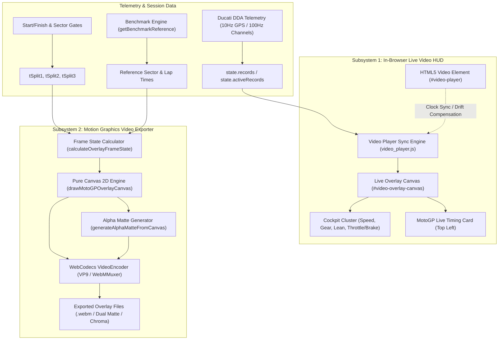
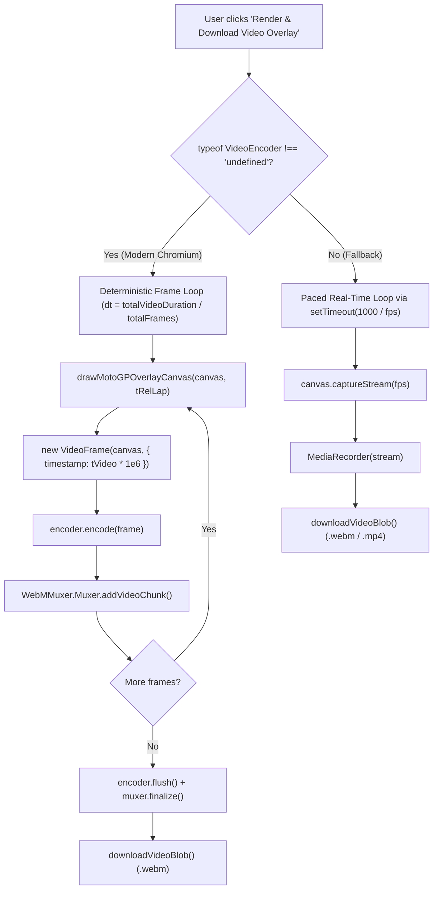

# Ducati DDA Video Overlay & Motion Graphics System Specification

This document provides a comprehensive technical overview of the video overlay and motion graphics architecture implemented in the Ducati DDA Telemetry & GPS Visualizer. It details the visual components, motion choreography, live in-browser rendering engine, and the offline video export pipeline.

---

## 1. System Architecture Overview

The video overlay system operates in two synchronized subsystems:



### Core Source Files
| File Path | Role & Key Responsibilities |
| :--- | :--- |
| [`viewer/js/seam_bar.js`](file:///c:/Users/maxim/Documents/DDA_Reader/viewer/js/seam_bar.js) | Pure Canvas 2D Modular Vertical Seam Data Bar motion graphics engine (`drawSeamBarCanvas`). Implements the authentic MotoGP timing card with expandable previous-laps drawer, 2D smoothed circuit map, arrowless accelerated turn ticker, wide G-meter with integrated lean arc, and throttle/brake strips. |
| [`viewer/js/video_export.js`](file:///c:/Users/maxim/Documents/DDA_Reader/viewer/js/video_export.js) | Motion graphics export controller (`exportSeamBarVideo`, `exportOverlayVideo`), frame state interpolator (`computeSeamBarTelemetryFrame`), alpha matte extraction, and WebCodecs offline rendering pipeline. |
| [`viewer/js/motogp_card.js`](file:///c:/Users/maxim/Documents/DDA_Reader/viewer/js/motogp_card.js) | Live DOM controller for the draggable on-screen MotoGP timing card (`#motogp-live-card`), benchmark comparison logic, and HTML/CSS animation triggers. |
| [`viewer/js/video_player.js`](file:///c:/Users/maxim/Documents/DDA_Reader/viewer/js/video_player.js) | In-browser onboard video player integration, timecode synchronization, drift micro-adjustment, and live HUD canvas rendering (`drawLiveVideoOverlay`). |
| [`viewer/js/playback.js`](file:///c:/Users/maxim/Documents/DDA_Reader/viewer/js/playback.js) | Visualizer master clock loop, telemetry record interpolation, and dispatching live draw calls to HUD and charts. |
| [`viewer/index.html`](file:///c:/Users/maxim/Documents/DDA_Reader/viewer/index.html) | DOM structure for the video viewport (`#panel-video`), live floating card (`#motogp-live-card`), and export configuration modals (`#modal-seam-bar-export`, `#modal-video-export`). |
| [`viewer/style.css`](file:///c:/Users/maxim/Documents/DDA_Reader/viewer/style.css) | Styling, fonts, chamfer clip-paths, gate highlight transitions, and fastest-lap banner animations. |
| [`viewer/js/state.js`](file:///c:/Users/maxim/Documents/DDA_Reader/viewer/js/state.js) | Global state management (`state.motogp`, `state.seamBar`, `state.video`), localStorage persistence, and cached DOM element references. |
| [`viewer/webm-muxer.min.js`](file:///c:/Users/maxim/Documents/DDA_Reader/viewer/webm-muxer.min.js) | Client-side container muxer for WebM VP9 video files. |
| [`viewer/mp4-muxer.min.js`](file:///c:/Users/maxim/Documents/DDA_Reader/viewer/mp4-muxer.min.js) | Client-side container muxer for MP4 AVC/H.264 video files (available in repo, ready for MP4 export). |
| [`dda_core.py`](file:///c:/Users/maxim/Documents/DDA_Reader/dda_core.py) | Python core engine that inlines and bundles all JavaScript, CSS, and muxer assets into standalone HTML reports. |

---

## 2. Motion Graphics Design & Visual Specification

The motion graphics design is modeled after the authentic **MotoGP International Broadcast Lap Timing Graphic**:

```
+-------------------------------------------------------------+
| DUCATI RIDER   Panigale V4 R                         [ 14 ] |  <- Solid Black Header (26px)
|-------------------------------------------------------------|
|                                                             |
|   1:21.147                                   +0.658         |  <- Lower Data Body (34px, 80% Black)
|                                                             |
|   [ M ][ S ]   [=== S1 ===] [=== S2 ===] [=== S3 ===]       |  <- Footer Strip (24px)
+-------------------------------------------------------------+
                                                             \   <- Chamfered corner (12px-14px)
```

### Dimensions, Geometry & Typography
- **Base Dimensions**: 280px width × 92px height (at 1.0x scale).
- **Scale Presets**:
  - `1.0x`: 1080p Full HD (280 × 92 px)
  - `1.5x`: 1440p Quad HD (420 × 138 px)
  - `2.0x`: 4K UHD (560 × 184 px)
- **Chamfer Geometry**: Diagonal bevel cut on the lower-right corner (`chamfer = 14 * scale`).
- **Header Geometry**: Height 26px * scale. Solid black `#000000` with 1px bottom border `rgba(255, 255, 255, 0.12)`.
- **Lower Data Body**: 80% opaque black background `rgba(0, 0, 0, 0.80)`.
- **Typography Hierarchy**:
  - Rider Name: `Outfit` (900 weight, 13px * scale, uppercase, `#ffffff`).
  - Motorcycle Model: `Inter` (400 weight, 10px * scale, `#c0c6d8`, truncated with ellipsis if exceeding available width).
  - Rider Number Badge: `Outfit` (900 weight, 19px * scale, centered, white on customizable colored badge).
  - Running Lap Time: `Outfit` / `JetBrains Mono` (900 weight, 24px * scale).
  - Split Delta: `Outfit` / `JetBrains Mono` (800 weight, 14px * scale).
  - Tyre Pills: `Inter` (900 weight, 8px * scale, bold white uppercase on `#1e222d` pill with white border).
  - Fastest Lap Banner: `Outfit` (900 weight, 32px–36px * scale, white on Ducati Red `#e10600`).

### Color Palette & Visual State Logic
| Element | State | Color | Glow / Shadow |
| :--- | :--- | :--- | :--- |
| **Number Badge** | Customizable | Default Purple `#6f2dbd`, Ducati Red `#e10600`, VR46 Yellow `#e1f500`, Pecco Red `#d00000`, Yamaha Blue `#00b0ff`, KTM Orange `#ff6d00` | Soft edge shadow |
| **Delta & Timer** | Ahead of benchmark (< 0.000s) | Red `#ff1744` | `box-shadow: 0 0 10px rgba(255,23,68,0.5)` |
| **Delta & Timer** | Within +0.500s of benchmark | Orange `#ff8c00` | `box-shadow: 0 0 10px rgba(255,140,0,0.4)` |
| **Delta & Timer** | Slower (> +0.500s) / Neutral | Grey `#8e94a5` | None |
| **Sector Bar** | Faster / Sector PB | Red `#ff1744` | `box-shadow: 0 0 8px #ff1744` |
| **Sector Bar** | Moderate (+0.0s to +0.5s) | Orange `#ff8c00` | `box-shadow: 0 0 8px #ff8c00` |
| **Sector Bar** | In Progress / Pending | Dark Grey `#2a2e3c` | None |
| **Sector Tic** | Real-time position cursor | Pure White `#ffffff` | `box-shadow: 0 0 6px #ffffff` |

---

## 3. Motion Choreography & Animation Timeline

The motion graphics system implements four primary animation routines:

```
0.0s       0.30s           0.67s         1.00s                       Finish +0.35s +0.85s +1.15s +1.65s +2.0s    +7.0s
 |-----------|---------------|-------------|----------------------------|-------|------|------|------|------|--------|
 Phase 1a    Phase 1b        Phase 2       Phase 3: Live Running Lap    Fastest Static Pan to Static Wipe   Hold Lap
 Stripe      Header Reveal   Lower Body    (Sector Tracking & Splits)   Wipe In        "LAP"         Away   Time
 Sweep       Badge Retract   Wipe Down
```

### 1. Intro Animation Sequence (0.00s to 1.00s)
- **Phase 1a (0.00s – 0.30s) — Header Stripe Sweep**:
  - A glowing horizontal bar matching the rider's badge color sweeps across the header bar from left to right using a sine ease curve: `stripeW = Math.max(8*s, w * sin((p1/0.45) * PI/2))`.
  - Colored drop shadow blur of `10 * s` creates an energy streak effect.
- **Phase 1b (0.30s – 0.67s) — Solid Header & Badge Snap**:
  - The header turns solid black (`#000000`).
  - The colored bar contracts from full-width to its final number badge position on the right border using a smooth cubic Hermite curve (`u * u * (3 - 2 * u)`).
  - The rider's number fades in simultaneously.
  - The rider's name and motorcycle model fade in from left to right.
- **Phase 2 (0.67s – 1.00s) — Lower Body Wipe Down**:
  - The lower 80% black body unfolds downward beneath the header: `curH = hdrH + (1 - cos(p2 * PI / 2)) * (h - hdrH)`.
  - Chamfer is dynamically clipped as height increases.
  - Data elements (timer, delta, tyres, sector track) are clipped within the unfolding rect with alpha fade-in.

### 2. Sector Split Gate Crossing Highlights (5.0-second duration)
When the motorcycle crosses Sector Gate 1 or Sector Gate 2:
1. **Entrance Transition (0ms to 250ms)**:
   - Smooth cubic Hermite ease (`gatePopFactor` 0.0 → 1.0).
   - Running timer shrinks from **24px to 14px** and dims to `rgba(255, 255, 255, 0.70)`, freezing on the exact split time.
   - Delta expands from **14px to 24px** (bold 900 weight) with an 8px colored drop shadow glow matching the delta color.
2. **Static Hold (0.25s to 4.75s)**:
   - Split time remains frozen so the viewer can read the sector performance.
3. **Exit Transition (4.75s to 5.00s)**:
   - Smooth cubic Hermite ease (`gatePopFactor` 1.0 → 0.0).
   - Sizes smoothly interpolate back to normal (Timer 24px, Delta 14px).
   - Timer resumes displaying real-time elapsed lap time.

### 3. Post-Lap Finish & Fastest Lap Celebration (5.0s or 7.0s duration)
Triggered when crossing the Start/Finish line:
- **Standard Lap Finish**:
  - The middle row switches to a single, bold, centered **30px Lap Time**.
  - The delta is centered in the footer row (13px mono font).
  - Sector bars hide.
  - State holds for 5.0 seconds.
- **Fastest Lap Celebration Sequence (2.0s animation + 5.0s hold)**:
  - **Stage 1 (0.00s – 0.35s)**: Red `#e10600` banner wipes in from the right edge across the lower body with "FASTEST" centered in 32px bold white text.
  - **Stage 2 (0.35s – 0.85s)**: Static hold on "FASTEST" banner for 0.5s.
  - **Stage 3 (0.85s – 1.15s)**: Vertical rolling pan (Hermite ease). "FASTEST" rolls downwards out of view while "LAP" (36px) rolls down into the vertical center.
  - **Stage 4 (1.15s – 1.65s)**: Static hold on "LAP" for 0.5s.
  - **Stage 5 (1.65s – 2.00s)**: Banner wipes away to the right edge, smoothly revealing the final lap time underneath.
  - **Stage 6 (2.00s – 7.00s)**: Static 5.0-second display of the final lap time (30px red) and delta.

---

## 4. Video Export Engine & Alpha Matte Generation

The video exporter in [`viewer/js/video_export.js`](file:///c:/Users/maxim/Documents/DDA_Reader/viewer/js/video_export.js) (`exportOverlayVideo`) is built entirely client-side, requiring no backend or command-line tools.

### Supported Background & Alpha Export Modes

```
+----------------------------------------------------------------------------------------------------+
| MODE                     OUTPUT FORMAT     ALPHA CHANNEL        COMPATIBILITY                      |
+----------------------------------------------------------------------------------------------------+
| dual_matte (Default)     2x .webm files    Exact Luma Mask      Premiere Pro, DaVinci Resolve, FCP |
| transparent              1x .webm file     VP9 Native Alpha     DaVinci Resolve, OBS, Web Players  |
| side_by_side             1x .webm file     Luma Mask on Right   All NLEs via Crop/Extract          |
| alpha_only               1x .webm file     Pure Grayscale Mask  Track Matte Keying                 |
| dark                     1x .webm file     No Alpha (#0b0d12)   Direct PiP / Standalone Playback   |
| greenscreen              1x .webm file     No Alpha (#00ff00)   Legacy Chroma Key                  |
| bluescreen               1x .webm file     No Alpha (#0000ff)   Legacy Chroma Key                  |
+----------------------------------------------------------------------------------------------------+
```

### The Dual-Matte System (Zero Artifacts)
Native video alpha formats (like VP9 alpha or ProRes 4444) can cause color fringing or gamma shifts across different operating systems and video editors. The **Dual-Matte System** avoids this completely by generating two separate streams:

1. **Color Stream (`_Color.webm`)**:
   - The card graphic is rendered over solid, mathematically pure `#000000` black.
   - Text anti-aliasing and subpixel borders blend into black with zero haloing.
2. **Alpha Matte Stream (`_AlphaMatte.webm`)**:
   - Generated by [`generateAlphaMatteFromCanvas()`](file:///c:/Users/maxim/Documents/DDA_Reader/viewer/js/video_export.js#L718-L738).
   - Reads the raw RGBA pixels from the transparent canvas via `ctx.getImageData()`.
   - Extracts the alpha byte (`srcData[i + 3]`, values `0` to `255`) and assigns it identically to Red, Green, and Blue channels (`destData[i] = destData[i+1] = destData[i+2] = a`), setting alpha to `255`.
   - Produces a high-contrast grayscale luma mask (0 = black = transparent, 255 = white = opaque, intermediate = translucent anti-aliasing).
3. **NLE Usage**:
   - In Premiere Pro: Place `_Color.webm` on Track V2, `_AlphaMatte.webm` on Track V3, and apply **Track Matte Key** pointing to V3 (Luma Matte).
   - In DaVinci Resolve: Add `_AlphaMatte.webm` as an External Matte in the Color Page.

### Encoding Architecture: WebCodecs vs. MediaRecorder



- **WebCodecs Advantage**: Non-realtime deterministic rendering. A 2-minute 60 FPS lap (7,200 frames) renders in ~15–20 seconds without dropping a single frame, regardless of display refresh rate or system load.
- **Muxer Library**: [`viewer/webm-muxer.min.js`](file:///c:/Users/maxim/Documents/DDA_Reader/viewer/webm-muxer.min.js) packages chunks into an ISO/EBML WebM container with clean cue points and index tables.

---

## 5. Live In-Browser Video Player HUD Integration

The in-browser player in [`viewer/js/video_player.js`](file:///c:/Users/maxim/Documents/DDA_Reader/viewer/js/video_player.js) integrates onboard action footage (GoPro, Insta360, DJI, iPhone) with live telemetry:

### View Modes
- **`split`**: 50/50 side-by-side view of interactive GPS Leaflet track map and onboard video with an interactive draggable vertical resizer splitter.
- **`video-only`**: Onboard video expanded to fill the entire main viewport.
- **`map-only`**: Standard GPS track map view.
- **`pip`**: Picture-in-Picture floating video window over the track map.

### Live Cockpit Cluster Overlay
While the video plays, [`drawLiveVideoOverlay()`](file:///c:/Users/maxim/Documents/DDA_Reader/viewer/js/video_player.js#L418-L598) draws onto `#video-overlay-canvas` in real time:

```
+-------------------------------------------------------------+
| [MotoGP Timing Card Overlay]                                |  <- Top Left
|                                                             |
|                                                             |
|                                                             |
|                                                             |
|  +--------------------+  +---+  +---+                       |
|  | 142       4   48°  |  | T |  | B |                       |  <- Cockpit Cluster (Bottom Left)
|  | MPH     GEAR       |  | P |  | R |                       |
|  +--------------------+  | S |  | K |                       |
|                          +---+  +---+                       |
+-------------------------------------------------------------+
```

1. **Cockpit Cluster Card (Bottom Left)**:
   - Dark matte glassmorphic container (`rgba(10, 13, 18, 0.82)` with white border).
   - Speedometer: Large 36px digits with dynamic unit toggle (MPH / KM/H).
   - Gear Indicator: 36px magenta digits (`N`, `1` through `6`).
   - Lean Angle Gauge: Circular radial arc gauge (`0°` to `60°`). Shifts to bright yellow at moderate lean, and turns `#ff0055` red when exceeding 42° of lean.
2. **Dynamic Throttle & Braking Bars (Adjacent to Cluster)**:
   - **Throttle (TPS)**: Smooth vertical bar in bright green (`#00e676`), height mapped 0% to 100%.
   - **Braking**: Vertical bar in racing red (`#ff1744`), height mapped proportionally to negative longitudinal G deceleration (`accel_long_g`).
3. **MotoGP Timing Card (Top Left)**:
   - Dynamically calls `drawMotoGPOverlayCanvas()` using current playback state.

### Timecode Synchronization Engine
- **Offset Calibration**: `t_video = t_telemetry + offsetSeconds`.
- **1-Click Sync at Start/Finish**: Clicking `🏁 1-Click Sync at S/F` computes `offsetSeconds = video.currentTime - lap.start_time_s`.
- **Nudge Controls**: Multi-step fine tuning (`-0.5s`, `-1 Fr (0.033s)`, `+1 Fr (0.033s)`, `+0.5s`).
- **Drift Compensation**:
  - Small drift (`0.12s < |drift| < 1.5s`): Dynamically nudges `playbackRate` up/down by ±5% to lock audio and video smoothly without audible pitch warble.
  - Large drift (`|drift| > 1.5s`): Hard seeks `video.currentTime` with a 1200ms debounce buffer to avoid choking the hardware video decoder pipeline.

---

## 6. Modular Vertical Seam Data Bar Engine (`seam_bar.js`)

The **Modular Vertical Seam Data Bar Engine** is a specialized high-density motion graphics HUD designed specifically for composite **16:9 split-screen onboard video layouts** (e.g. 4:3 Front Cockpit Camera alongside a 9:16 Vertical Rear Action Camera). 

Positioned along the dividing seam between camera feeds, the vertical bar spans the **full height of the video frame** (1080px in 1080p, 2160px in 4K), anchoring timing and completed laps to the top and dynamic gauges to the bottom, leaving a spacious open middle zone for lap expansion and post-production branding.

```
+----+------------------------------------+
|[512| 0:32.138                    +0.941 |  <- Top Cluster: Streamlined Timing Card (58px)
|    | [M][S]   [--S1--] [--S2--] [--S3-] |
| R  |------------------------------------|
| E  | PREVIOUS LAPS                      |  <- Expanding Lap History Drawer
| D  | L1   1:45.912               +1.674 |     (Drops down into open middle space;
|    | L2   1:44.238                 ★ PB |      zero displacement of lower gauges)
| S  +------------------------------------+
| P  |                                    |
| I  |         [ OPEN MIDDLE ZONE ]       |  <- Spacious Negative Space
| N  |                                    |     (Lap expansion, sponsor logos, decals)
| E  |                                    |
|    |------------------------------------+
| // | THUNDERHILL RACEWAY                |  <- Bottom Cluster: Pinned to Bottom of Frame
|    |              .-.                   |     - Floating Smoothed Circuit Map (136px)
| S  |             /   \                  |
| F  |            |  o  |                 |
| V  |             \___/                  |
| 2  |------------------------------------|
|    |     T3   [   T4   ]    T5          |     - Horizontal Turn Ticker Ribbon (48px)
|    |            113m to apex            |
| W  |------------------------------------|
| H  |              ( 38° )               |     - Wide G-Meter & Integrated Lean Arc (156px)
| I  |             /-------\              |
| T  |            (   (o)   )             |
| E  |             \-------/              |
|    |              0.78 G                |
| B  |------------------------------------|
| L  | TPS [===================]     82%  |     - Precision Dual Telemetry Strips (44px)
| A  | BRK [========           ]     35%  |       (Directly on carbon plate, no inner box)
+----+------------------------------------+
```

### Module Specifications & Functional Behaviors

#### 1. Full-Height Structural Frame Spanning & Top/Bottom Split Alignment
- **Full Video Frame Span**: Background plate spans the entire vertical dimension (`barH`), filling from top safe margin to bottom corner notches in 1080p and 4K UHD.
- **Top Cluster (Pinned to Top)**: Timing Card and Expanding Previous Laps Drawer are anchored at the top of the column.
- **Spacious Open Middle Zone**: Provides generous negative space over the technical carbon glass backplate where completed laps expand downward without shifting or disrupting any mission-critical gauges.
- **Bottom Cluster (Pinned to Bottom)**: Circuit Map, Turn Ticker, G-Meter/Lean Gauge, and Pedals are permanently pinned to the bottom of the video frame.

#### 2. Left Aero Spine (Vertical Number Badge + Rotated 90° Typography)
- **Top Number Badge**: Bold team-colored pill (`[512]`) capping the top-left of the vertical rail.
- **Rotated 90° Typography**: Rotated counter-clockwise (`-90°`) to read upward along the left spine between the Ducati red racing stripe and the crisp white speed blade:
  - Rider Name in pure white (`SLOW FAST GUY`)
  - Accent slashes in Ducati Red (` // `)
  - Shortened bike model in slate grey (`SFV2`)
- **De-cluttered Top Card**: Removing the horizontal header from the top timing card reduces base height from 88px to 58px.

#### 3. Streamlined Timing Card with Non-Disruptive Lap Drawer
- **Clean Running Timer**: During continuous lap progress outside of sector gates, the timing card displays exclusively the running lap timer in bold monospace (`20 * s` px), leaving the card completely uncluttered with zero delta digits.
- **Sector Split Popups (5.0s Window)**: Split differences are shown exclusively when crossing sector split gates (for a 5-second popup duration). The split time freezes on the gate split, and the delta pops up on the right (`#ff1744` ahead / `#ff8c00` within 0.5s / `#8e94a5` behind).
- **Historical Session Benchmark Only**: Delta calculations strictly benchmark against the fastest flying lap completed *prior* to the current lap in the session (`lap_number < activeLap.lap_number`). It never compares against future laps. On Lap 1 (or before any completed flying lap exists), no delta is displayed.
- **Dynamic Text Scaling & Overflow Guard**: If delta difference is 10+ seconds (e.g. `+14.250s`), the engine dynamically computes text metrics and scales font sizes proportionally down to guarantee a minimum gap, completely preventing any collision or overlap onto the timer digits.
- **Footer Strip**: Front and rear tyre compound pills (`M`, `S`, `H`) and MotoGP sector blocks with a glowing real-time position tic cursor.
- **Zero-Displacement Lap Drawer**: Expanding downward into the open middle zone guarantees that the circuit map and lower cockpit instruments never jump or jitter.

#### 4. Floating Smoothed Circuit Map
- **Track Name Header**: Automatically displays the active venue name in uppercase (e.g. `THUNDERHILL RACEWAY`) in place of generic headers.
- **Card-Proportional Width**: Scaled using metric bounding box analysis to occupy at least **75% to 82%** of the top card width.
- **Flat 2D Metric Projection**: Preserves true 1:1 metric aspect ratio with North strictly Up (eliminating distortion or vertical squishing).
- **Path Smoothing**: Rendered from a multi-point moving average of the session's best flying lap, eliminating GPS jitter and pit lane detours.
- **Markers**: White start/finish dot and a glowing pulsing Ducati Red bike position dot (`#e10600`) with radial aura and specular glint.

#### 5. High-Tech Horizontal Scrolling Turn Ticker Ribbon
- **Clean Center Bracket**: Center active turn box `[ T2 ]` framed in electric yellow (`#ffd600`) with clean brackets.
- **Accelerated Snapping Slide Transition**: Smooth cubic Hermite curve snapping into the incoming turn.
- **Countdown to Apex**: Cyan digital distance readout (`${distM}m to apex`) placed directly below the bracket box.

#### 6. Unified Wide Friction Circle G-Meter & Integrated Lean Arc
- **Wide Instrument Diameter**: Scaled to occupy **80% of the card width** ($\ge 75\%$).
- **Seamless Lean Arc Integration**: Multi-zone lean arc attached directly to the perimeter of the 1.5G circle.
- **Instantaneous Total G Readout**: Clean scalar readout `${totalG.toFixed(2)} G` centered below the friction circle.

#### 7. Frameless Precision Throttle & Brake Strips
- **Integrated Surface**: Nested container box removed; strips float directly over the carbon-dark backplate with uniform margins matching the map and G-meter.
- **White Typography**: Both `TPS` / `BRK` labels and digital percentage readouts (`${Math.round(tps)}%`, `${Math.round(brakePct)}%`) are rendered in crisp, high-contrast white (`#ffffff`).
- **Throttle (TPS)**: Smooth horizontal bar in bright green (`#00e676`) with glowing fill.
- **Brake (BRK)**: Smooth horizontal bar in racing red (`#ff1744`) proportional to deceleration force.

---

## 7. Detailed Code & Function Index

| Function Name | Location | Inputs | Description |
| :--- | :--- | :--- | :--- |
| `drawSeamBarCanvas()` | [`seam_bar.js:24`](file:///c:/Users/maxim/Documents/DDA_Reader/viewer/js/seam_bar.js#L24) | `ctx, barW, barH, frameData, config, animTime` | Master render routine for the Modular Vertical Seam Data Bar. Staggers intros, manages module heights, and delegates to individual widgets. |
| `drawVerticalRacingBackground()` | [`seam_bar.js:145`](file:///c:/Users/maxim/Documents/DDA_Reader/viewer/js/seam_bar.js#L145) | `ctx, x, y, w, h, animTime, s, glassAlpha` | Renders the 3-layer vertical racing background plate (carbon dark glass, red racing stripe, white speed blade) with staggered downward swipe animations. |
| `drawMotoGPTimingCard()` | [`seam_bar.js:370`](file:///c:/Users/maxim/Documents/DDA_Reader/viewer/js/seam_bar.js#L370) | `ctx, x, y, w, h, riderData, timingData, s, glassAlpha, animTime, drawerH, numDisplayLaps` | Renders the vertical MotoGP timing card with shortened bike model and drop-down lap history drawer. |
| `drawFloatingTrackMap()` | [`seam_bar.js:680`](file:///c:/Users/maxim/Documents/DDA_Reader/viewer/js/seam_bar.js#L680) | `ctx, x, y, w, h, mapData, s, dotColor, animTime` | Renders the wide 2D circuit map with track name header and glowing bike dot. |
| `drawScrollingTurnTicker()` | [`seam_bar.js:790`](file:///c:/Users/maxim/Documents/DDA_Reader/viewer/js/seam_bar.js#L790) | `ctx, x, y, w, h, turnData, s, animTime` | Renders the arrowless turn ticker ribbon with cubic accelerated snapping slide animation. |
| `drawUnifiedGAndLeanInstrument()` | [`seam_bar.js:890`](file:///c:/Users/maxim/Documents/DDA_Reader/viewer/js/seam_bar.js#L890) | `ctx, x, y, w, h, gmeterData, leanData, s, animTime` | Renders the wide 80% friction circle G-meter with integrated outer lean arc and instantaneous G readout. |
| `drawThrottleBrakeCard()` | [`seam_bar.js:1080`](file:///c:/Users/maxim/Documents/DDA_Reader/viewer/js/seam_bar.js#L1080) | `ctx, x, y, w, h, data, s, glassAlpha, animTime` | Renders dual throttle (TPS) and brake telemetry bars. |
| `computeSeamBarTelemetryFrame()` | [`video_export.js:1902`](file:///c:/Users/maxim/Documents/DDA_Reader/viewer/js/video_export.js#L1902) | Telemetry state, records, laps, turns, map points | Computes exact, smoothly interpolated frame telemetry, track progression, continuous turn scroll position, and sector states. |
| `exportSeamBarVideo()` | [`video_export.js:1490`](file:///c:/Users/maxim/Documents/DDA_Reader/viewer/js/video_export.js#L1490) | None (reads UI DOM state) | Orchestrates the WebCodecs/MediaRecorder video rendering loop for the Vertical Seam Data Bar. |
| `generateAlphaMatteFromCanvas()` | [`video_export.js:718`](file:///c:/Users/maxim/Documents/DDA_Reader/viewer/js/video_export.js#L718) | `srcCanvas, destCanvas` | Fast pixel manipulation loop copying RGBA alpha bytes into a high-contrast grayscale RGB luma matte. |
| `playIntroPreviewAnimation()` | [`video_export.js:594`](file:///c:/Users/maxim/Documents/DDA_Reader/viewer/js/video_export.js#L594) | None | Runs a 1-second preview of the intro stripe-and-wipe animation directly in the export dialog. |
| `playFastestLapPreviewAnimation()` | [`video_export.js:652`](file:///c:/Users/maxim/Documents/DDA_Reader/viewer/js/video_export.js#L652) | None | Runs a 6-second preview of the fastest-lap multi-stage celebration animation in the export dialog. |
| `getBenchmarkReference()` | [`motogp_card.js:41`](file:///c:/Users/maxim/Documents/DDA_Reader/viewer/js/motogp_card.js#L41) | `lapObj` | Determines the delta baseline: compares against Compare Lap B, fastest prior completed lap, or session best lap. |
| `updateMotoGPCard()` | [`motogp_card.js:84`](file:///c:/Users/maxim/Documents/DDA_Reader/viewer/js/motogp_card.js#L84) | `lapObj, interpTime` | Updates the DOM elements of the live draggable floating card during interactive playback. |
| `drawLiveVideoOverlay()` | [`video_player.js:418`](file:///c:/Users/maxim/Documents/DDA_Reader/viewer/js/video_player.js#L418) | `optRecord, optSpd, optRpm, optTps, optLean, optGLong, optGLat` | Renders the Cockpit Cluster (speedometer, gear, lean angle arc, throttle/brake bars) and MotoGP card onto `#video-overlay-canvas`. |
| `syncVideoPlayback()` | [`video_player.js:322`](file:///c:/Users/maxim/Documents/DDA_Reader/viewer/js/video_player.js#L322) | `currentTimeS, isPlaying, playbackSpeed, isFromVideoMasterClock` | Synchronizes HTML5 video currentTime with visualizer master clock, handling micro-rate adjustments and drift. |

---

## 7. Current Limitations & Architectural Adjustment Vectors

Based on the investigation of the codebase, here are the key architectural gaps and opportunities for enhancement:

### 1. Missing Cockpit Cluster in Video Export
- **Current State**: The live in-browser player displays the complete Cockpit Cluster (speedometer, gear, lean angle arc gauge, throttle & brake bars). However, `exportOverlayVideo()` only renders the MotoGP timing card.
- **Adjustment Vector**: Add an overlay layout selector in the export modal:
  - `MotoGP Timing Card Only`
  - `Cockpit Telemetry Cluster Only` (Speed, Gear, Lean, Throttle, Brake)
  - `Full Broadcast Package` (Timing Card in top-left + Cockpit Cluster in bottom-left).

### 2. Cropped Widget vs. Full-Frame (16:9) Overlay Export
- **Current State**: The exported video canvas is tightly cropped around the widget dimensions (e.g., 420 × 138 px at 1.5x). When imported into Premiere or DaVinci Resolve, the editor must manually scale and reposition the clip into the corner of their timeline.
- **Adjustment Vector**: Offer a **Full Frame Composition** toggle (`1920 × 1080` or `3840 × 2160`). In full-frame mode, the canvas matches native video dimensions with alpha transparency, with graphics positioned precisely in broadcast-standard safe margins. The user can drop the overlay onto their timeline with zero manual positioning.

### 3. MP4 (H.264 / AVC) Export Support
- **Current State**: The export engine exclusively outputs WebM VP9 files. While WebM is supported in DaVinci Resolve and modern NLEs, some Windows/macOS editing workflows prefer standard MP4 files.
- **Opportunity**: The repository already includes [`viewer/mp4-muxer.min.js`](file:///c:/Users/maxim/Documents/DDA_Reader/viewer/mp4-muxer.min.js). Adding an MP4 H.264 export path (using `codec: 'avc1.64002a'` via WebCodecs `VideoEncoder` + `Mp4Muxer.Muxer`) will allow exporting dual-channel MP4s natively.

### 4. Telemetry Interpolation in Export Engine
- **Current State**: `calculateOverlayFrameState()` currently computes timer, delta, and sector progress from split times.
- **Opportunity**: When adding cockpit telemetry (speed, RPM, lean angle, throttle, brakes, G-forces) to the exporter, frame-accurate interpolation between adjacent 10Hz/100Hz telemetry records will provide butter-smooth gauge needles and 60 FPS motion graphics matching the bike's physics.

### 5. Multi-Style Theme Engine
- **Current State**: `state.video.overlayTheme` is initialized in `state.js` with placeholders (`'motogp'`, `'panigale_dash'`, `'minimal'`), but only MotoGP is currently rendered.
- **Opportunity**: Implement a Ducati Panigale TFT dashboard theme (mimicking the actual bike instrument cluster with tachometer bar, DTC intervention indicators, and gear shift lights) alongside the MotoGP broadcast theme.

---

## 8. Summary Table: Live HUD vs. Video Exporter Capabilities

| Capability | Live In-Browser Video Player | Offline Video Exporter |
| :--- | :--- | :--- |
| **Target Destination** | HTML5 `<canvas>` inside web app | Downloadable `.webm` video files |
| **MotoGP Timing Card** | Yes (Dynamic DOM + Canvas) | Yes (Pure Canvas 2D) |
| **Rider & Bike Customization** | Yes (Name, Bike, Number, Tyres, Badge Color) | Yes (Full Form Controls + Live Preview) |
| **Sector Splits & Gate Pops** | Yes (5-second gate highlight) | Yes (Exact 5s freeze with Hermite easing) |
| **Fastest Lap Celebration** | Yes (CSS slide/wipe transitions) | Yes (6-stage Canvas 2D wipe & roll down) |
| **Cockpit Speedometer** | Yes (MPH or KM/H) | *Not yet integrated into export loop* |
| **Gear Indicator** | Yes (`N`, `1`–`6`) | *Not yet integrated into export loop* |
| **Lean Angle Radial Arc** | Yes (Color-coded >42°) | *Not yet integrated into export loop* |
| **Throttle & Brake Bars** | Yes (TPS % and Longitudinal G) | *Not yet integrated into export loop* |
| **Alpha Matte Generation** | Not applicable (Browser DOM compositing) | Yes (Exact pixel-level luma mask) |
| **Render Speed** | Real-time (1x playback speed) | Accelerated WebCodecs (faster than real-time) |

---

## 9. Modular Vertical Seam Data Bar Architecture & Intro Motion Graphics

### Overview
Designed specifically for split-camera dual-video workflows (e.g. 4:3 Front Camera + 9:16 Vertical Rear Camera), the **Modular Vertical Seam Data Bar** spans the full vertical frame (1080p or 4K) directly on the dividing seam between camera views.

### Structural Design & Layout
- **Full-Frame Vertical Background**:
  - Dark frosted carbon backplate (`rgba(8, 10, 16, 0.72)`) with signature 45° chamfers.
  - Left Aero Spine zone featuring a Ducati Red racing stripe, white speed blade with angled chevron winglets, prominent rider number badge, and rotated 90° typography (`RIDER // BIKE`) running up the vertical spine.
- **Top Cluster**:
  - MotoGP Timing Card & Lap Drawer (running timer, completed lap history, sector status).
  - Pinned to the top of the video frame.
- **Bottom Cluster**:
  - Pinned to the bottom of the video frame, leaving generous breathing room in the center of the frame for lap delta graphics, sponsorships, or logos.
  - Floating smoothed single-lap circuit map with live glowing bike dot.
  - High-tech turn indicator ribbon with bracketed active turn and distance-to-apex countdown.
  - Unified wide G-meter with integrated 58° multi-zone lean angle arc.
  - Precision throttle and brake bars with white text and percentage readouts.

### Bespoke Intro Animation Choreography (0.00s – 2.00s)
1. **0.00s – 0.45s: Left Aero Spine Wipe-Up**
   - The red racing stripe, white speed blade, and rotated typography wipe **upward from the bottom** of the frame using snappy cubic easing (`u < 0.5 ? 4*u^3 : 1 - (-2*u + 2)^3 / 2`).
2. **0.30s – 0.50s: Rider Number Badge Pop**
   - Just as the spine wipe reaches the top of the frame, the top number badge pops and settles into place with a subtle spring-scale effect.
3. **0.40s – 0.75s: Carbon Glass Backplate Slide-Out**
   - Just as the spine wipe completes, the carbon frosted glass backplate slides out to the right from behind the aero spine, accompanied by a glowing cyan laser sweep line along its leading edge.
4. **0.65s – 1.05s: Timing Card & Drawer Slide-In**
   - The top MotoGP timing card slides in smoothly from the left from behind the aero spine with an opacity fade.
5. **0.80s – 1.45s: Circuit Map Laser Polyline Draw**
   - The circuit map progressively traces the track geometry around the loop starting from the Start/Finish line, with a glowing cyan spark at the leading tip.
6. **0.95s – 1.25s: Turn Indicator Bracket HUD Flicker**
   - The electric yellow `[ ]` brackets flicker stroboscopically into existence.
7. **1.10s – 1.65s: Unified G/Lean Meter Circular Iris Wipe**
   - The friction circle and lean angle instrument expands outward from its central origin via a circular iris wipe, bordered by an intense neon cyan scanner wavefront ring.
8. **1.20s – 1.55s: Active Turn Number Slide-In**
   - The active turn number (`T1`) slides in from the right edge into the bracketed focus box.
9. **1.30s – 1.65s: Track Name Header Fade-In**
   - The uppercase track name tag fades in above the circuit map.
10. **1.30s – 1.75s: Throttle & Brake Slide-In & Dynamic Fill**
    - The throttle and brake bars slide in from the left and fade in, with the green TPS and red brake bars dynamically filling up to their live values.
11. **1.40s – 1.70s: Glowing Bike Dot Fade-In**
    - The pulsing Ducati Red bike position dot fades in onto the track loop.
12. **1.45s – 1.75s: Distance to Apex Countdown Fade-In**
    - The cyan digital countdown readout fades in beneath the turn ticker.
13. **2.00s: Full Bar Settled & Flying**
    - The entire vertical seam bar is live, animated, and seamlessly synchronized with vehicle telemetry.

