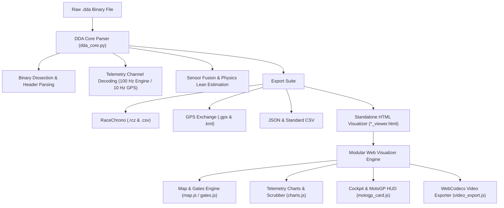

# 🏍️ Ducati Data Analyzer (DDA) Reader & Visualizer Pro

## 📖 Project Overview

**DDA Reader & Visualizer Pro** is a comprehensive reverse-engineering suite, converter, and high-performance interactive visualizer for **Ducati Data Analyzer (`.dda`)** telemetry files.

Ducati superと一緒に (e.g. Panigale V4, V2, Streetfighter, SuperSport) record rich on-board CAN bus telemetry and high-precision GPS data during track days and road sessions. Historically, analyzing this data required proprietary, locked-down desktop software that lacked modern export capabilities, visual telemetry overlays, or compatibility with mobile track apps like RaceChrono.

This project delivers:
1. **100% Standalone Binary Parser**: Decodes raw `.dda` binary streams directly into clean engineering units without proprietary dependencies.
2. **Universal Export Suite**: Exports to RaceChrono (`.rcz`, `.csv`), GPS standard formats (`.gpx`, `.kml`), JSON, and standard CSV.
3. **Interactive 60 FPS Web Visualizer**: A portable, zero-server standalone HTML dashboard featuring interactive GPS track maps, dynamic gate editing, synchronized multi-channel waveforms, dual-lap comparison deltas ($\Delta t$, $\Delta v$, $\Delta \text{TPS}$), and cockpit gauges.
4. **MotoGP Broadcast HUD & Video Overlay Exporter**: Generates broadcast-quality lap timer overlays with real-time sector deltas, animated entry reveals, 5-second split freeze pops, fastest lap celebration banners, and **Dual-Channel Alpha / Luma Matte video export** for flawless compositing in DaVinci Resolve and Adobe Premiere Pro.

---

## ⚙️ How It Works: System Architecture & Algorithms



---

### 1. Reverse-Engineering the Binary `.dda` Format

Ducati DDA files consist of a structured ASCII/XML configuration header followed by high-frequency multiplexed binary packet streams:

- **Header Section**: Contains session metadata, rider name, bike model, firmware revision, track information, and channel descriptors.
- **Multiplexed Data Frames**:
  - **Engine Telemetry (100 Hz)**: Engine RPM, Throttle Position Sensor (TPS %), Front/Rear Wheel Speeds, Gear position, Engine coolant temperature, and DTC (Ducati Traction Control) torque intervention cuts.
  - **GPS Subframes (10 Hz)**: High-precision Latitude, Longitude, Altitude, GPS Speed, and satellite fix metrics.
- **GPS Anchor Synchronization**: Engine CAN packets and GPS packets operate on distinct clock frequencies. `dda_core.py` performs sub-millisecond continuous timestamp alignment and linear interpolation to anchor every engine sample to the exact physical GPS coordinate.
- **Physics-Based Lean Angle Fusion**: For bikes lacking dedicated 6-axis IMU lean channels, lean angle is derived using centripetal acceleration, motorcycle wheelbase geometry, and roll-rate kinematics:
  $$\theta_{\text{lean}} = \arctan\left(\frac{v^2}{g \cdot R}\right)$$

---

### 2. High-Precision Timing Gates & Sector Analysis

- **Geometric Intersect Algorithm**: Gates are modeled as directional vector lines perpendicular to the track bearing. Crossing events are computed via 2D vector segment line intersection math ($ub \in [0, 1]$), ensuring sub-frame timing precision accurate to milliseconds regardless of GPS sample frequency.
- **Auto-Track Detection**: Automatically detects circuits (e.g., Sonoma Raceway, Laguna Seca, Thunderhill) by computing Haversine distance from the session's GPS centroid to known circuit databases.
- **Interactive Gate Editor**: Users can add, drag, rotate ($\pm 10^\circ, 180^\circ$), and auto-align Start/Finish and Sector Split gates directly on the Leaflet satellite map.

---

### 3. MotoGP Broadcast HUD & Video Overlay Engine

- **Real-Time HUD**: Renders the authentic MotoGP television broadcast timing element, displaying rider name, bike model, colored number badge, live running lap timer, and 3-sector progressive delta indicators:
  - 🔴 **Red**: Faster than benchmark ($< -0.000\text{s}$)
  - 🟠 **Orange / Yellow**: Within $0.500\text{s}$ of benchmark
  - ⚪ **Grey / White**: Slower than benchmark ($> +0.500\text{s}$)
- **5-Second Gate Split Pops**: When crossing a sector split gate, the timer pauses on the sector split time while the delta enlarges for 5 seconds before returning to active counting.
- **Fastest Lap Sequence**: When a new best lap is completed, the card triggers an authentic television graphic:
  $$0.0\text{s} \to 0.35\text{s} \text{ (Wipe in FASTEST)} \to 0.5\text{s} \text{ Hold} \to \text{Pan to LAP} \to 0.5\text{s} \text{ Hold} \to \text{Wipe away to Lap Time Display (5.0s)}$$

---

### 4. Dual-Channel Alpha / Luma Matte Video Pipeline

To completely eliminate chroma key fringing, edge bleeding, and green/blue halos on semi-transparent backgrounds and anti-aliased text:

- **Exact Grayscale Alpha Extraction**: Reads the 32-bit RGBA pixel array from the 2D canvas buffer and maps pixel opacity $A$ to RGB grayscale ($R=A, G=A, B=A, A=255$).
- **Dual WebCodecs VP9 Encoding**: Simultaneously encodes:
  1. `..._Color.webm`: Full-color HUD rendered over pure solid black (`#000000`).
  2. `..._AlphaMatte.webm`: Grayscale opacity mask ($255 = \text{solid white}$, $204 = 80\%\text{ translucent gray}$, $0 = \text{black}$).
- **NLE Track Matte Integration**: In Premiere Pro or DaVinci Resolve, applying the Alpha Matte video as a **Luma Matte** yields 100% pixel-perfect transparency with crystal-clear edges.

---

## 📁 Codebase Directory Structure

```
DDA_Reader/
├── dda_core.py                 # Core binary parser, telemetry engine & all exporters
├── dda_converter_gui.py        # Desktop Tkinter GUI & Batch CLI converter
├── dda_settings.json           # User preferences & circuit gate library storage
├── Run045-192535-00.14.dda     # Sample session binary dataset
├── Run045-192535-00.14_viewer.html # Generated self-contained HTML visualizer
├── pi.md                       # Complete Project Overview & Architecture Guide
│
└── viewer/                     # Standalone Visualizer Source Assets
    ├── index.html              # Core visualizer DOM layout & modal dialogs
    ├── style.css               # Futuristic dark glassmorphic styling & MotoGP themes
    ├── webm-muxer.min.js       # Client-side WebM multiplexer
    ├── mp4-muxer.min.js        # Client-side MP4 multiplexer
    ├── app.js                  # Main coordinator & event listeners
    │
    └── js/                     # Modular JavaScript Architecture
        ├── state.js            # App state, DOM cache, geometry math, & storage
        ├── motogp_card.js      # MotoGP live card controller & sector deltas
        ├── video_export.js     # WebCodecs VP9 video exporter & alpha matte engine
        ├── map.js              # Leaflet GPS map, heatmap shaders, & extrema markers
        ├── gates.js            # Gate editor, crossing detection, & sector timings
        ├── charts.js           # Multi-channel canvas waveforms & dual-lap comparison
        └── playback.js         # Transport loop, telemetry smoothing, & gauge updates
```

---

## 🛠️ Technologies & Libraries Used

### Backend & Core (Python)
- **Python 3.8+**: Pure standard library implementation (no heavy C-extensions or external binary dependencies required).
- **`struct`**: High-performance binary unpacking for little-endian integer, float, and bitfield decoding.
- **`tkinter` & `ttk`**: Native desktop graphical user interface supporting dark mode styling, drag-and-drop file queues, and batch conversions.
- **`json`**, **`xml.etree`**, **`math`**: Structured metadata parsing, export generation, and trigonometric navigation math.

### Frontend Visualizer & Video Engine (Web Platform)
- **HTML5 Canvas 2D**: 60 FPS hardware-accelerated telemetry waveform rendering and subpixel video frame rendering.
- **Vanilla Modern JavaScript (ES6+)**: Zero external frontend framework overhead (no React/Vue required), organized into modular component files.
- **WebCodecs API (`VideoEncoder`, `VideoFrame`)**: Hardware-accelerated, non-blocking 60 FPS VP9 video encoding directly inside the browser.
- **`webm-muxer` & `mp4-muxer`**: Client-side video multiplexers producing valid WebM and MP4 container files with zero server roundtrips.
- **Leaflet.js**: Lightweight mapping library supporting ESRI World Imagery, Carto Dark, and OpenStreetMap satellite tiles.
- **CSS3 Glassmorphism**: Custom racing UI with backdrop blur filters, responsive 16:10 / 1440p MacBook layout optimization, and high-DPI font rendering.

---

## 🚀 How to Run & Use

### 1. Launching the Desktop GUI
```bash
python dda_converter_gui.py
```
- Open any `.dda` file via the file dialog or drag-and-drop.
- Click **"Convert & Launch Visualizer"** to generate all export files and immediately open the interactive dashboard.

### 2. Command-Line Batch Conversion
```bash
# Convert a single DDA file into the full export suite + standalone HTML
python dda_converter_gui.py Run045-192535-00.14.dda

# Run directly in automated headless scripts
python -c "import dda_core; p = dda_core.DDAParser('Run045-192535-00.14.dda'); p.export_all('session_converted')"
```

### 3. Video Overlay Export in the Browser
1. In the visualizer, click **"🎬 Export Video Overlay"** in the top navigation bar.
2. Customize Rider Name, Bike Model, Number Badge Color, and Tyres.
3. Select your target Lap and adjust the **Lead In / Out** buffer slider ($0\text{s} \to 10\text{s}$).
4. Select **`Color + Matching Alpha Matte (Dual Files)`** and click **"Render & Download Video Overlay"**.
5. Import both `.webm` files into Premiere Pro or DaVinci Resolve, apply the Alpha Matte as a **Luma Matte**, and enjoy clean, artifact-free racing telemetry graphics over your GoPro footage!
