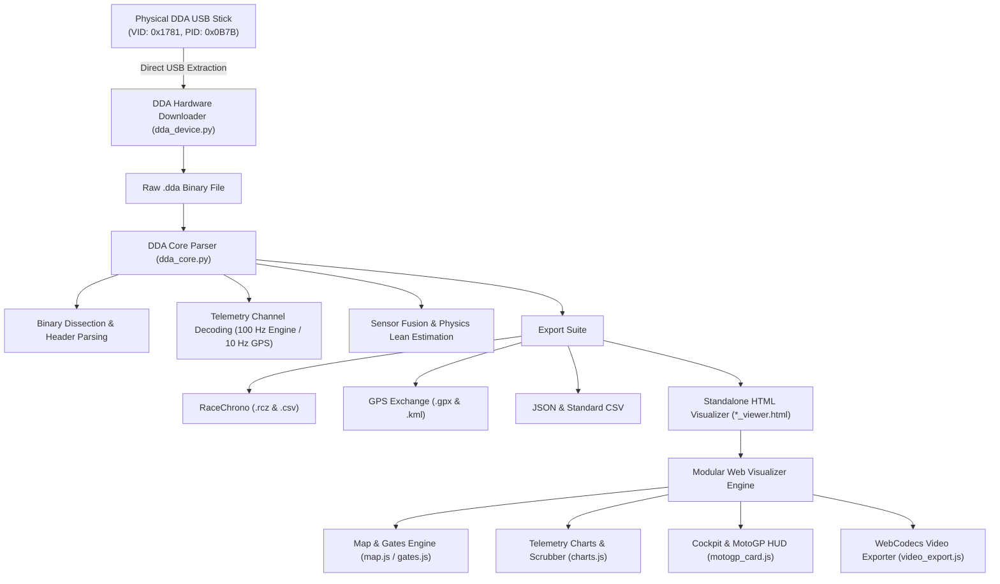

# 🏍️ Ducati Data Analyzer (DDA) Reader & Visualizer Pro

## 📖 Project Overview

**DDA Reader & Visualizer Pro** is a comprehensive reverse-engineering suite, hardware downloader, converter, and high-performance interactive visualizer for **Ducati Data Analyzer (`.dda`)** telemetry files.

Ducati motorcycles (e.g. Panigale V4/V2, 1199/1299, Streetfighter, SuperSport, Monster, Hypermotard, Multistrada, and SBK 1098/1198) record rich on-board CAN bus telemetry and high-precision GPS data during track days and road sessions. Historically, analyzing this data required proprietary, locked-down desktop software that lacked modern export capabilities, visual telemetry overlays, direct multi-run extraction, or compatibility with mobile track apps like RaceChrono.

This project delivers:
1. **Direct USB Hardware Extraction Engine**: Communicates directly with physical DDA USB sticks over WinUSB/libusb to extract and reassemble native `.dda` session files (zero-dependency native Windows `ctypes` driver).
2. **100% Standalone Binary Parser**: Decodes raw `.dda` binary streams directly into clean engineering units without proprietary dependencies.
3. **Universal Export Suite**: Exports to RaceChrono (`.rcz`, `.csv`), GPS standard formats (`.gpx`, `.kml`), JSON, and standard CSV.
4. **Interactive 60 FPS Web Visualizer**: A portable, zero-server standalone HTML dashboard featuring interactive GPS track maps, dynamic gate editing, synchronized multi-channel waveforms, dual-lap comparison deltas ($\Delta t$, $\Delta v$, $\Delta \text{TPS}$), and cockpit gauges.
5. **MotoGP Broadcast HUD & Video Overlay Exporter**: Generates broadcast-quality lap timer overlays with real-time sector deltas, animated entry reveals, 5-second split freeze pops, fastest lap celebration banners, and **Dual-Channel Alpha / Luma Matte video export** for flawless compositing in DaVinci Resolve and Adobe Premiere Pro.

---

## ⚙️ How It Works: System Architecture & Algorithms



---

### 1. Reverse-Engineering the Binary `.dda` Format

Ducati DDA files consist of a structured ASCII/XML configuration header followed by high-frequency multiplexed binary packet streams:

- **Header Section**: Contains session metadata, rider name, bike model, firmware revision, track information, and channel descriptors.
- **Multiplexed Data Frames**:
  - **Engine Telemetry (100 Hz)**: Engine RPM, Throttle Position Sensor (TPS %), Front/Rear Wheel Speeds, Gear position, Engine coolant temperature, and DTC (Ducati Traction Control) torque intervention cuts.
  - **GPS Subframes (10 Hz)**: High-precision Latitude, Longitude, Altitude, GPS Speed, and satellite fix metrics.
- **GPS Anchor Synchronization**: Engine CAN packets and GPS packets operate on distinct clock frequencies. `dda_core.py` performs sub-millisecond continuous timestamp alignment and linear interpolation to anchor every engine sample to the exact physical GPS coordinate.
- **Physics-Based Lean Angle Fusion**: For bikes lacking dedicated 6-axis IMU lean channels, lean angle is derived using centripetal acceleration, motorcycle wheelbase geometry, and roll-rate kinematics:
  $$\theta_{\text{lean}} = \arctan\left(\frac{v^2}{g \cdot R}\right)$$

---

### 2. Reverse-Engineered DDA USB Hardware Downloader Engine

The physical DDA device (`VID_1781&PID_0B7B`) communicates via custom WinUSB bulk endpoints rather than standard Mass Storage:
- **Zero-Dependency WinUSB Transport**: Uses direct `ctypes` bindings to Windows' built-in `C:\Windows\System32\winusb.dll` and `kernel32.dll` to access the stick without requiring extra drivers or packages.
- **Cross-Platform LibUSB Fallback**: Fully supported on macOS and Linux via `libusb-package` / `pyusb`.
- **Read-Only Protocol Commands**:
  - `0xCE`: Queries UTF-16LE hardware serial string (e.g., `0GOOA8BJ4M2B60373VPJ`).
  - `0xD7`: Queries external SPI Flash chip manufacturer and capacity IDs.
  - `0xD3` & `0xD4`: Reads the 1,324-byte hardware acquisition definition table from microcontroller flash at `0x0801CC00`, ensuring automatic dynamic channel mapping for any Ducati model.
  - `0xDE` (V4) / `0xDC` (V3 fallback): Enumerates all recorded sessions, unpacking flash start addresses, byte sizes, and bit-packed date/time stamps.
  - `0xC1`: Sequentially reads 256-byte chunks of raw telemetry data.
- **Non-Destructive Safety**: All write, format, and erase opcodes are excluded to protect device flash integrity.
- **Native Container Assembly**: Reassembles the retrieved blocks into a valid native `.dda` v4 binary file (`DDA`, `INF`, `DAQ`, `ACQ` blocks).

---

### 3. High-Precision Timing Gates & Sector Analysis

- **Geometric Intersect Algorithm**: Gates are modeled as directional vector lines perpendicular to the track bearing. Crossing events are computed via 2D vector segment line intersection math ($ub \in [0, 1]$), ensuring sub-frame timing precision accurate to milliseconds regardless of GPS sample frequency.
- **Auto-Track Detection**: Automatically detects circuits (e.g., Sonoma Raceway, Laguna Seca, Thunderhill) by computing Haversine distance from the session's GPS centroid to known circuit databases.
- **Interactive Gate Editor**: Users can add, drag, rotate ($\pm 10^\circ, 180^\circ$), and auto-align Start/Finish and Sector Split gates directly on the Leaflet satellite map.

---

### 4. MotoGP Broadcast HUD & Video Overlay Engine

- **Real-Time HUD**: Renders the authentic MotoGP television broadcast timing element, displaying rider name, bike model, colored number badge, live running lap timer, and 3-sector progressive delta indicators:
  - 🔴 **Red**: Faster than benchmark ($< -0.000\text{s}$)
  - 🟠 **Orange / Yellow**: Within $0.500\text{s}$ of benchmark
  - ⚪ **Grey / White**: Slower than benchmark ($> +0.500\text{s}$)
- **5-Second Gate Split Pops**: When crossing a sector split gate, the timer pauses on the sector split time while the delta enlarges for 5 seconds before returning to active counting.
- **Fastest Lap Sequence**: When a new best lap is completed, the card triggers an authentic television graphic:
  $$0.0\text{s} \to 0.35\text{s} \text{ (Wipe in FASTEST)} \to 0.5\text{s} \text{ Hold} \to \text{Pan to LAP} \to 0.5\text{s} \text{ Hold} \to \text{Wipe away to Lap Time Display (5.0s)}$$

---

### 5. Dual-Channel Alpha / Luma Matte Video Pipeline

To completely eliminate chroma key fringing, edge bleeding, and green/blue halos on semi-transparent backgrounds and anti-aliased text:

- **Exact Grayscale Alpha Extraction**: Reads the 32-bit RGBA pixel array from the 2D canvas buffer and maps pixel opacity $A$ to RGB grayscale ($R=A, G=A, B=A, A=255$).
- **Dual WebCodecs VP9 Encoding**: Simultaneously encodes:
  1. `..._Color.webm`: Full-color HUD rendered over pure solid black (`#000000`).
  2. `..._AlphaMatte.webm`: Grayscale opacity mask ($255 = \text{solid white}$, $204 = 80\%\text{ translucent gray}$, $0 = \text{black}$).
- **NLE Track Matte Integration**: In Premiere Pro or DaVinci Resolve, applying the Alpha Matte video as a **Luma Matte** yields 100% pixel-perfect transparency with crystal-clear edges.

---

### 6. Track Section Drag Selection & Multi-Lap Stacked Telemetry Comparison Engine

- **Interactive Drag-to-Select**: Riders can click and drag anywhere along the GPS track path on the map (or click `✂️ Select Corner`) to isolate any corner, chicane, or straight.
- **Draggable Boundary Handles**: Displays draggable `🚩 Entry` and `🏁 Exit` flag markers on the track for effortless boundary fine-tuning.
- **Multi-Lap Segment Normalization**: Automatically projects and extracts the exact telemetry segment from every lap in the session, normalizing them across section distance ($0\text{m} \to D_{\text{section}}\text{m}$).
- **Stacked Multi-Lap Waveforms**:
  - Overlays all laps' speed curves, throttle traces, lean angles, and gear profiles on top of each other.
  - Color-codes each lap with the fastest section run highlighted in glowing purple/gold.
  - Automatically identifies apex minimum speed dip points and throttle application distance.
- **Corner Performance Leaderboard Table**: Ranks every lap through that section with Section Time ($\Delta t$), Entry Speed, Apex Min Speed, Exit Speed, and Peak Lean Angle.

---

## 📁 Codebase Directory Structure

```
DDA_Reader/
├── dda_core.py                 # Core binary parser, telemetry engine & all exporters
├── dda_device.py               # Hardware USB reader & standalone CLI downloader
├── dda_converter_gui.py        # Desktop PyQt6/PySide6 GUI, Exporter & Download Dialog
├── build_executables.py        # Cross-platform PyInstaller app bundler (.app / .exe)
├── launch_mac.command          # Double-clickable macOS Finder launcher script
├── dda-download.md             # Complete USB hardware downloader reference guide
├── pi.md                       # Master Project Overview & Architecture Guide
├── dda_settings.json           # User preferences & circuit gate library storage
├── requirements.txt            # Python dependencies (PyQt6, pyusb, libusb-package, pyinstaller)
│
├── dist/                       # Packaged Standalone Executables
│   ├── Ducati DDA Reader.exe   # Portable Windows Standalone Executable
│   └── Ducati DDA Reader.app   # Double-clickable macOS Application Bundle
│
└── viewer/                     # Standalone Visualizer Source Assets
    ├── index.html              # Core visualizer DOM layout & modal dialogs
    ├── style.css               # Futuristic dark glassmorphic styling & MotoGP themes
    ├── webm-muxer.min.js       # Client-side WebM multiplexer
    ├── mp4-muxer.min.js        # Client-side MP4 multiplexer
    ├── app.js                  # Main coordinator & event listeners
    │
    └── js/                     # Modular JavaScript Architecture
        ├── state.js            # App state, DOM cache, geometry math, & storage
        ├── motogp_card.js      # MotoGP live card controller & sector deltas
        ├── video_export.js     # WebCodecs VP9 video exporter & alpha matte engine
        ├── map.js              # Leaflet GPS map, heatmap shaders, & extrema markers
        ├── gates.js            # Gate editor, crossing detection, & sector timings
        ├── charts.js           # Multi-channel canvas waveforms & dual-lap comparison
        └── playback.js         # Transport loop, telemetry smoothing, & gauge updates
```

---

## 🛠️ Technologies & Libraries Used

### Backend & Hardware Drivers (Python)
- **Python 3.8+**: Pure standard library engine for telemetry decoding and hardware USB communication.
- **`winusb.dll` / `kernel32.dll` (`ctypes`)**: Direct Windows kernel USB driver access with zero third-party dependencies.
- **`PyQt6` / `PySide6`**: Modern desktop GUI framework delivering native Dark Mode, high-DPI scaling, hardware download manager dialog, telemetry inspector `QTableWidget`, and console processing log.
- **`PyInstaller`**: Native executable bundler producing zero-dependency `.app` bundles (macOS) and `.exe` binaries (Windows).
- **`struct`**: High-performance binary unpacking for little-endian integer, float, and bitfield decoding.
- **`json`**, **`xml.etree`**, **`math`**: Structured metadata parsing, export generation, and trigonometric navigation math.

### Frontend Visualizer & Video Engine (Web Platform)
- **HTML5 Canvas 2D**: 60 FPS hardware-accelerated telemetry waveform rendering and subpixel video frame rendering.
- **Vanilla Modern JavaScript (ES6+)**: Zero external frontend framework overhead (no React/Vue required), organized into modular component files.
- **WebCodecs API (`VideoEncoder`, `VideoFrame`)**: Hardware-accelerated, non-blocking 60 FPS VP9 video encoding directly inside the browser.
- **`webm-muxer` & `mp4-muxer`**: Client-side video multiplexers producing valid WebM and MP4 container files with zero server roundtrips.
- **Leaflet.js**: Lightweight mapping library supporting ESRI World Imagery, Carto Dark, and OpenStreetMap satellite tiles.
- **CSS3 Glassmorphism**: Custom racing UI with backdrop blur filters, responsive 16:10 / 1440p MacBook layout optimization, and high-DPI font rendering.

---

## 🚀 How to Run & Use

### 1. Downloading from the DDA USB Stick

#### Option A: Graphical User Interface
1. Launch the app (`python dda_converter_gui.py` or double-click `dist\Ducati DDA Reader.exe`).
2. Click **`⚡ Download from DDA Stick`** in the top red header banner (or **`⚡ Read Stick...`** in the file selection box).
3. Check the runs you wish to extract, pick your destination directory (default `./downloads/`), and click **`⬇️ Download Selected Runs`**.
4. When finished, choose **Yes** to automatically load the newest run into the Telemetry Inspector and 3D Visualizer!

#### Option B: Standalone Interactive CLI Downloader
```powershell
python dda_device.py
```
* Displays all recorded runs on the stick, lets you enter specific run numbers (e.g. `0 1 5`) or `all`, and downloads native `.dda` files with real-time transfer progress.

---

### 2. Launching the Desktop Application
```bash
python dda_converter_gui.py
```
* **Windows Executable**: Double-click `dist\Ducati DDA Reader.exe` in File Explorer.
* **macOS App Bundle**: Double-click `dist/Ducati DDA Reader.app` in Finder.

---

### 3. Building Standalone Executables for Distribution
```bash
python build_executables.py
```
This generates the standalone binary inside `dist/` (`.exe` on Windows, `.app` on macOS, binary on Linux) bundling all browser visualizer assets from `viewer/`.

---

### 4. Command-Line Batch Conversion
```bash
# Convert a single DDA file into the full export suite + standalone HTML
python dda_converter_gui.py Run045-192535-00.14.dda

# Batch convert all .dda files in a folder to specified formats
python dda_converter_gui.py --batch /path/to/dda_folder --formats html,racechrono,rcz,csv
```

---

### 5. Video Overlay Export in the Browser
1. In the visualizer, click **"🎬 Export Video Overlay"** in the top navigation bar.
2. Customize Rider Name, Bike Model, Number Badge Color, and Tyres.
3. Select your target Lap and adjust the **Lead In / Out** buffer slider ($0\text{s} \to 10\text{s}$).
4. Select **`Color + Matching Alpha Matte (Dual Files)`** and click **"Render & Download Video Overlay"**.
5. Import both `.webm` files into Premiere Pro or DaVinci Resolve, apply the Alpha Matte as a **Luma Matte**, and enjoy clean, artifact-free racing telemetry graphics over your GoPro footage!
