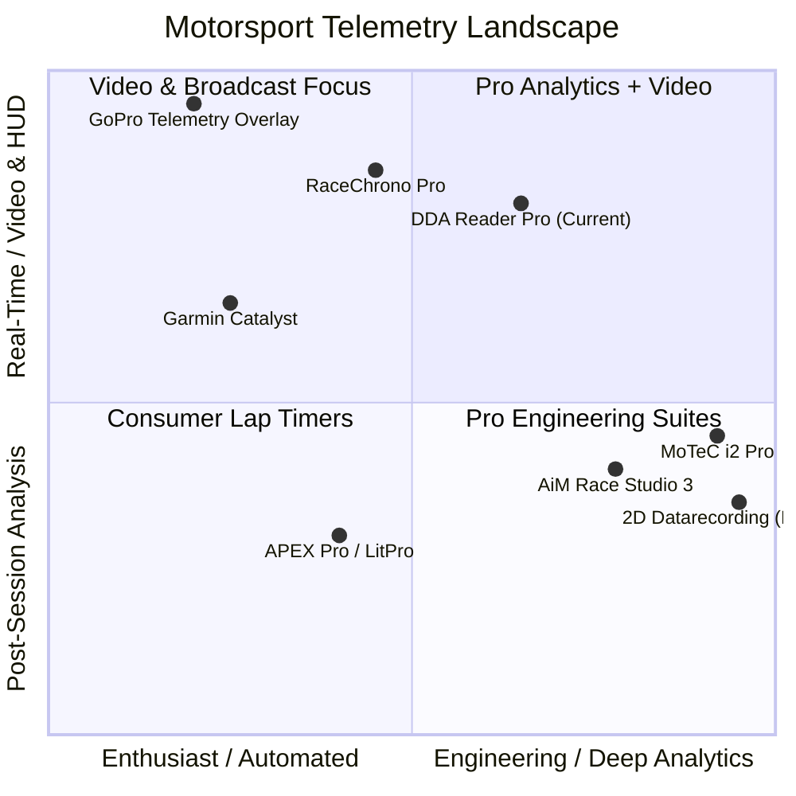
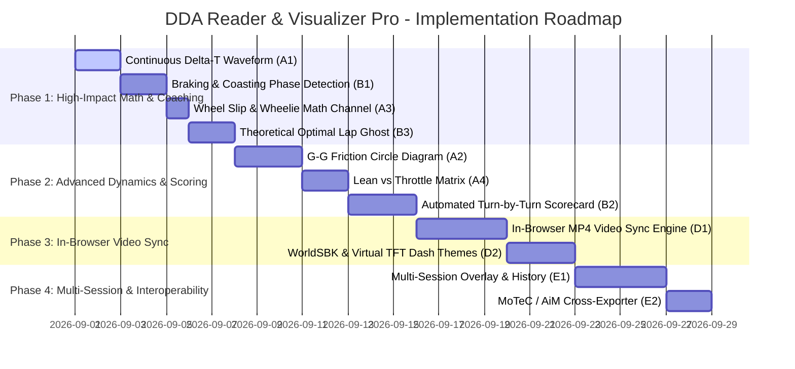

# 🗺️ Ducati DDA Reader & Visualizer Pro - Product Roadmap & Industry Benchmark

## 📖 Executive Summary

**DDA Reader & Visualizer Pro** has evolved beyond a basic proprietary binary parser into a full-featured motorsport telemetry analysis platform and video overlay generator. 

This document benchmarks the application against industry-standard professional and consumer telemetry suites (MoTeC i2 Pro, AiM Race Studio 3, 2D Datarecording, RaceChrono Pro, APEX Pro, and Garmin Catalyst) and outlines a structured feature catalog and phased development roadmap.

---

## 🏎️ Industry Landscape & Competitor Benchmark

### Feature Comparison Matrix

| Capability / Feature | Official Ducati DDA | RaceChrono Pro | AiM Race Studio 3 | MoTeC i2 Pro | **DDA Reader Pro (Current)** |
| :--- | :---: | :---: | :---: | :---: | :---: |
| **Binary `.dda` Parsing (No Pro Software)** | ⚠️ Native Only | ❌ Needs CSV | ❌ | ❌ | ✅ **100% Native Parser** |
| **GPS Track Map & Heatmaps** | ❌ Basic 2D | ✅ Satellite | ✅ Satellite | ✅ Vector | ✅ **Satellite, Dark, OSM + Multi-Heatmaps** |
| **Corner Drag-to-Select & Multi-Lap Stacking** | ❌ | ⚠️ Manual split | ⚠️ Fixed turns | ⚠️ Fixed turns | ✅ **Interactive Map Drag & Stack** |
| **MotoGP Broadcast HUD Overlay** | ❌ | ⚠️ Generic | ❌ | ❌ | ✅ **Authentic MotoGP Card & Splits** |
| **Dual Alpha/Luma Matte Video Export** | ❌ | ❌ | ❌ | ❌ | ✅ **WebCodecs 60 FPS Dual Matte** |
| **Continuous Time Delta ($\Delta t$) Curve** | ❌ | ✅ | ✅ | ✅ | ⚠️ *Header pills only (No continuous curve)* |
| **G-G Friction Circle & Traction Diagram** | ❌ | ⚠️ Basic | ✅ | ✅ | ⏳ *Planned* |
| **Tire Slip Ratio & Wheelie Detection** | ❌ | ❌ | ⚠️ Optional | ✅ | ⏳ *Planned* |
| **Coaching Insights (Braking & Coasting)** | ❌ | ⚠️ Manual | ✅ | ✅ | ⏳ *Planned* |
| **Integrated In-Browser GoPro Video Sync** | ❌ | ✅ | ✅ | ✅ | ⏳ *Planned* |
| **Multi-Session Comparison (Day-over-Day)** | ❌ | ✅ | ✅ | ✅ | ⏳ *Planned* |

---

## 🚀 Feature Catalog by Category

### 📊 Category A: Advanced Motorcycle Physics & Derived Math Channels

#### A1. Continuous Time Delta ($\Delta t$) Waveform Chart
- **Description**: A dedicated chart lane plotting running time delta ($\pm \text{seconds}$) continuously against lap distance ($0 \to D_{\text{lap}}$) comparing Lap A vs Lap B (or Best vs Reference).
- **Rider Value**: Immediately pinpoints the exact meter on track where time was gained or lost (e.g., gained 0.3s on trail-braking entry, lost 0.4s on corner exit drive).
- **Complexity**: Low (1-2 days) | **Impact**: ⭐⭐⭐⭐⭐

#### A2. Motorcycle G-G Diagram & Friction Circle (Traction Utilization)
- **Description**: Interactive X-Y scatter plot displaying Longitudinal Acceleration ($G_{\text{long}}$: Braking / Drive) vs Lateral Acceleration ($G_{\text{lat}}$: Cornering Lean G) with a dynamic friction limit envelope.
- **Rider Value**: Shows trail-braking smoothness (transition from straight-line braking into full lean) and reveals unused tire grip capacity at maximum lean.
- **Complexity**: Medium (2-3 days) | **Impact**: ⭐⭐⭐⭐⭐

#### A3. Wheel Slip Ratio & Wheelie / DTC Intervention Analyzer
- **Description**: Math channel comparing Front Wheel Speed ($V_f$) vs Rear Wheel Speed ($V_r$):
  $$\text{Slip Ratio} = \frac{V_{\text{rear}} - V_{\text{front}}}{V_{\text{front}}} \times 100\%$$
- **Rider Value**: Detects rear wheel spin under hard drive, front wheel lift (wheelies when $V_f$ decelerates while $V_r$ accelerates), and correlates with DTC torque reduction cuts.
- **Complexity**: Low (1 day) | **Impact**: ⭐⭐⭐⭐

#### A4. Lean Angle vs. Throttle Application Matrix
- **Description**: 2D heat grid showing how early and aggressively the rider opens the throttle ($0 \to 100\%$ TPS) as a function of lean angle ($0^\circ \to 55^\circ$).
- **Rider Value**: Vital safety and coaching tool for 200+ HP superbikes (detects risky "high throttle at high lean" habits vs proper "stand the bike up before wide-open throttle").
- **Complexity**: Low-Med (1-2 days) | **Impact**: ⭐⭐⭐⭐

---

### 🧠 Category B: Automated Rider Coaching & Performance Intelligence

#### B1. Braking & Coasting Phase Analysis ("Roll Time" Detection)
- **Description**: Classifies every meter of the track into one of 4 rider phases:
  1. 🟢 **Full Power / Acceleration** (TPS $> 60\%$)
  2. 🟡 **Maintenance / Partial Throttle** (TPS $5\% - 60\%$)
  3. ⚪ **Coasting / Dead Time** (TPS $< 5\%$, No Braking/Decel)
  4. 🔴 **Heavy Braking** (Decel $> 0.4g$)
- **Rider Value**: "Coasting" is the #1 lap time killer for track riders. Quantifies wasted coasting time per lap and highlights coasting zones on the map in orange.
- **Complexity**: Low-Med (2 days) | **Impact**: ⭐⭐⭐⭐⭐

#### B2. Automated Turn-by-Turn Performance Scorecard
- **Description**: Automated extraction and summary table for every corner on the circuit showing:
  - **Braking Point Marker** (distance before apex where decel initiated).
  - **Apex Minimum Speed & Peak Lean Angle**.
  - **Throttle Pick-up Point** (distance relative to apex).
  - **Corner Exit Speed**.
  - **Consistency Rating** ($\sigma$ variance across all session laps).
- **Complexity**: Medium (2-3 days) | **Impact**: ⭐⭐⭐⭐

#### B3. "Theoretical Optimal Lap" Telemetry Ghost
- **Description**: Reconstructs a full virtual lap by stitching together your fastest Sector 1, Sector 2, and Sector 3 into a single continuous telemetry ghost trace on the map and waveforms.
- **Rider Value**: Visualizes the rider's true potential ceiling if every best sector were executed in a single lap.
- **Complexity**: Low-Med (1-2 days) | **Impact**: ⭐⭐⭐⭐

---

### 🗺️ Category C: Advanced Spatial & Track Map Visualizations

#### C1. True Spatial Racing Line Comparison (Line Deviation Overlay)
- **Description**: High-resolution GPS lateral offset rendering showing differences in corner entry lines, apex clipping points, and corner exit trajectories between two laps.
- **Rider Value**: Identifies whether a wide entry or early apex generated higher exit drive.
- **Complexity**: Medium (2-3 days) | **Impact**: ⭐⭐⭐⭐

#### C2. 3D Track Elevation & Slope Gradient Profile
- **Description**: Altitude and slope gradient (%) profile waveform highlighting track compression dips and crests (e.g., Sonoma Turn 3 uphill or Laguna Seca Corkscrew drop).
- **Complexity**: Low (1 day) | **Impact**: ⭐⭐⭐

#### C3. Sector-Colorized Track Map Ribbon & Dual Ghost Animation
- **Description**: Color-coded sector ribbons directly on the satellite map with synchronized animated ghost markers running side-by-side.
- **Complexity**: Low (1 day) | **Impact**: ⭐⭐⭐⭐

---

### 🎬 Category D: Video Integration & Next-Gen Overlays

#### D1. Integrated In-Browser Onboard Video Player with Auto-Sync
- **Description**: Drag and drop an onboard GoPro/Insta360 MP4 video directly into the visualizer, with a 1-click sync alignment tool (e.g., align at S/F line cross).
- **Rider Value**: Watch your actual on-bike footage synchronized frame-by-frame with the telemetry scrubber, map cursor, and gauge cluster.
- **Complexity**: Medium (3 days) | **Impact**: ⭐⭐⭐⭐⭐

#### D2. Additional Broadcast Overlay Themes & Virtual TFT Dash
- **Description**: Expand video exporter options:
  - **WorldSBK Broadcast HUD** (Sleek tachometer arc, live lean needle, throttle/brake bars).
  - **Cockpit Panigale TFT Dash** (Authentic virtual TFT cluster export).
  - **Minimalist Apex Strip** (Compact lower-third overlay for social media / YouTube reels).
- **Complexity**: Medium (2-3 days) | **Impact**: ⭐⭐⭐⭐

---

### 💾 Category E: Multi-Session & Data Interoperability

#### E1. Multi-Session Comparison (Day-over-Day / Rider vs Coach)
- **Description**: Load multiple `.dda` or `.json` session files simultaneously to compare morning vs afternoon track conditions or compare rider laps against an instructor.
- **Complexity**: Med-High (3-4 days) | **Impact**: ⭐⭐⭐⭐

#### E2. MoTeC `.ld` & AiM RS3 Cross-Exporter
- **Description**: Export parsed DDA telemetry directly into native MoTeC `.ld` / `.ldx` or AiM CSV formats for race teams and professional trackside engineers.
- **Complexity**: Medium (2 days) | **Impact**: ⭐⭐⭐

---

## 🗓️ Phased Implementation Roadmap

---

## 🎯 Quick-Reference Priority Matrix

| Phase | Feature | Complexity | Key Benefit |
| :--- | :--- | :---: | :--- |
| **Phase 1** | **A1. Continuous $\Delta t$ Curve** | Low | Pinpoint exact meters where time is gained/lost |
| **Phase 1** | **B1. Braking & Coasting Detection** | Low-Med | Eliminate the #1 lap time killer (dead roll time) |
| **Phase 1** | **A3. Slip Ratio & Wheelie Detection** | Low | Diagnose traction loss and DTC intervention |
| **Phase 1** | **B3. Optimal Lap Ghost Trace** | Low-Med | Visualize full theoretical lap ceiling |
| **Phase 2** | **A2. G-G Friction Circle** | Medium | Evaluate trail-braking and tire grip usage |
| **Phase 2** | **A4. Lean vs Throttle Heatmap** | Low-Med | Coach safe throttle pickup while leaned over |
| **Phase 2** | **B2. Turn Performance Scorecard** | Medium | Corner-by-corner braking, apex, exit metrics |
| **Phase 3** | **D1. In-Browser Video Sync** | Medium | Sync onboard GoPro directly inside the browser |
| **Phase 3** | **D2. WSBK & TFT Dash Overlays** | Medium | Multiple broadcast & cockpit rendering styles |
| **Phase 4** | **E1. Multi-Session Comparison** | Med-High | Compare sessions across track days or riders |
| **Phase 4** | **E2. MoTeC / AiM Exporter** | Medium | Interoperate with professional racing tools |
